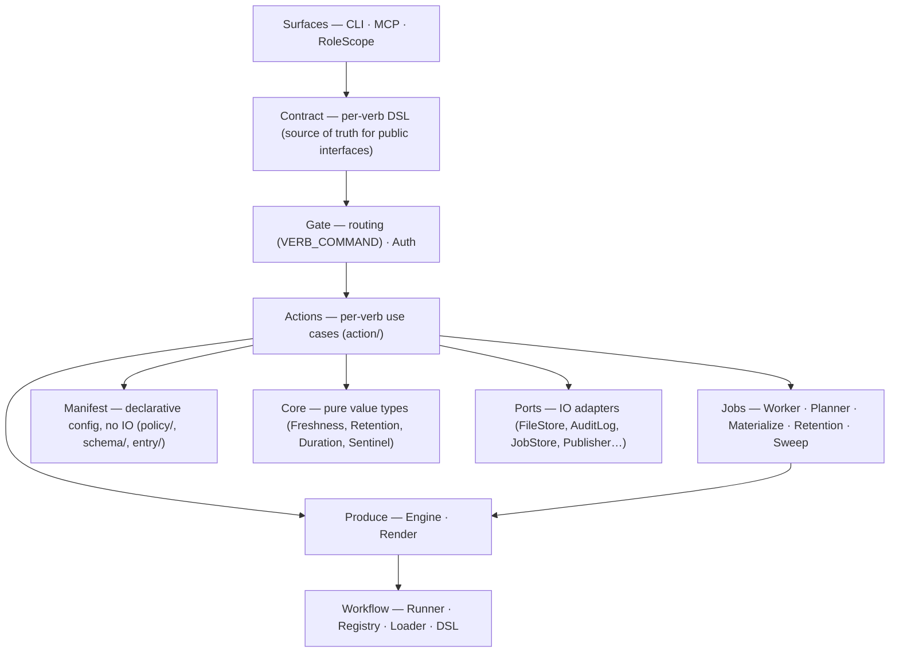

# Textus architecture

> **Explanation** · for contributors · **read this first** for orientation before SPEC
> **SSoT for** the Ruby implementation layout (layers, container, ports, dispatch paths) · **reviewed** 2026-06 (v0.54)



*Dependency rule: inward only.* Surfaces → Contract → Gate → Actions → inner layers. Actions never reference surfaces.

### What lives in each layer

**Surfaces**

```
surfaces/cli/     CLI command generation from contracts
surfaces/mcp/     MCP server — stdio JSON-RPC 2.0, tools derived from contracts
surfaces/role_scope.rb
                  (Store#as(role)) — holds (container, role, dry_run, correlation_id);
                  all verb methods injected via define_method in textus.rb
```

**Contract**

```
contract/         Per-verb DSL — verb, summary, surfaces, arg, view.
                  Contract::Binder.inputs_from_ordered splits the uniform inputs hash
                  into positional/keyword args for every surface.
```

**Gate + Auth**

```
gate.rb           VERB_COMMAND  (verb symbol → Command class)
                  Gate#dispatch(cmd) — Auth → action call
gate/auth.rb      Authorization engine — FLOOR predicates + rule guards
```

**Actions**

```
action/{get,list,put,key_delete,key_mv,accept,reject,propose,
        drain,enqueue,audit,blame,deps,rdeps,published,boot,doctor,
        rule_explain,rule_list,rule_lint,pulse,
        data_mv,key_mv_prefix,key_delete_prefix,
        schema_envelope,where,uid,jobs}.rb
```

**Jobs**

```
jobs/planner.rb   Rules-driven job planning — seeds materialize/refresh/sweep jobs
jobs/worker.rb    Queue drain — leases and runs jobs from JobStore
jobs/materialize.rb  Per-key produce job → Produce::Engine.converge
jobs/refresh.rb   Per-key refresh job (retention-rule-triggered)
jobs/retention.rb Retention policy check
jobs/sweep.rb     Lane sweep job
```

**Produce**

```
produce/engine.rb         Engine.converge(container:, call:, keys:)
                          For each key: looks up a registered workflow and runs it,
                          or publishes existing bytes for entries with publish targets.
produce/render.rb         Mustache template expansion for publish targets
```

**Workflow**

```
workflow/runner.rb    Runs a Definition: build_context → execute_steps → publish
workflow/registry.rb  In-memory list of registered Definitions; Registry#for(key)
workflow/loader.rb    Loads .textus/workflows/*.rb files via Collector DSL
workflow/dsl.rb       Textus.workflow "name" { match "...", step :fetch { ... }, publish }
workflow/context.rb   Context passed to each step (key, entry, config, container, call)
workflow/pattern.rb   Key-matching pattern (glob via File.fnmatch?)
workflow/errors.rb    NotFound, StepFailed
```

**Core (pure value types)**

```
Freshness::{Verdict,Evaluator}
Core::Duration  Core::Sentinel
```

**Infrastructure**

```
Store              (composition root — wires ports, vends Container)
Storage::FileStore (bytes-only port: read/write/delete/exists?/etag)
Manifest           (Data, Resolver, Policy, Rules)
Schemas            (eager-load cache)
Ports::{AuditLog,JobStore,Publisher,Clock,
        BuildLock,SentinelStore}
Entry::{Markdown,Json,Yaml,Text}  (format strategies)
```

## How a verb becomes a method

All actions live under `lib/textus/action/`. The shape is uniform:

```ruby
module Textus
  module Action
    class Get < Base
      extend Textus::Contract::DSL

      verb :get
      summary "Read an entry by key."
      surfaces :cli, :mcp
      arg :key, String, required: true, positional: true

      BURN = :sync

      def initialize(key:)
        super()
        @key = key
      end

      def call(container:, call:)
        ...
      end
    end
  end
end
```

Verbs are looked up in a static frozen table (`Textus::Action::VERBS`) that maps `:get → Action::Get`, `:put → Action::Put`, etc. Adding a new verb is one entry in `VERBS` plus the class — no metaprogramming.

## Container

Use cases never see the raw `Store`. `Textus::Container` is a single record holding the wired collaborators:

```ruby
Container = Data.define(
  :manifest, :file_store, :schemas, :root,
  :audit_log, :workflows, :gate
)
```

The `Store` builds one `Container` at boot; every action receives it via `(container:, call:)`. Workflow steps receive a `Workflow::Context` (key, entry, config, container, call).

## Ports

| Class | Role |
|---|---|
| `Ports::Storage::FileStore` | Bytes-only FS I/O — `read`, `write`, `delete`, `exists?`, `etag`. |
| `Ports::AuditLog` | Append-only structured log (`audit.log`). Owns seq numbering, file-locking, rotation. |
| `Ports::Clock` | Supplies `Time.now` — module-function so tests can swap without DI boilerplate. |
| `Ports::Publisher` | Copies a built artifact to a repo-relative consumer path and writes a sentinel. |
| `Ports::BuildLock` | Process-exclusive `flock` guard over the produce pipeline. |
| `Ports::JobStore` | Persistent job queue used by `drain` workers; tracks ready/leased/done/failed jobs. |
| `Ports::SentinelStore` | Reads and writes per-target sentinel files for managed-file detection. |

Application use cases access ports only through `Container` fields — never through the raw `Store`.

### Envelope

`Envelope::Reader` and `Envelope::Writer` split the envelope pipeline into read-only parse and write-with-audit halves.

**Reader** (`lib/textus/envelope/reader.rb`) — resolves a key through `manifest.resolver`, reads bytes via `FileStore`, parses via the format strategy, returns an `Envelope`. No audit, no permissions.

**Writer** (`lib/textus/envelope/writer.rb`) — owns the full write pipeline: serialize → schema-validate → etag-check → `FileStore#write` → `AuditLog#append`. The audit append is the commit step.

Both are built from a `Container` via named constructors — `Writer.from(container:, call:)` and `Reader.from(container:)`.

## Manifest carving

`Manifest` is a `Data.define` struct with four named members:

| Member | Class | Responsibility |
|---|---|---|
| `data` | `Manifest::Data` | Frozen value: raw, root, lanes, entries, audit_config, role_caps. |
| `resolver` | `Manifest::Resolver` | Key → `Resolution(entry, path, remaining)`. Nested entry enumeration and fuzzy-match suggestions. |
| `policy` | `Manifest::Policy` | Zone/capability authority — `verb_for_lane`, `roles_with_capability`, `propose_lane_for(role)`. |
| `rules` | `Manifest::Rules` | Pattern-matched rule engine. `rules.for(key)` → `RuleSet(guard, retention, react)`. |

## Read path (`store.get(key)`)

`Action::Get` is a **pure read** — it resolves the path, reads bytes, parses the envelope, and annotates a freshness verdict. It never ingests and never mutates.

1. CLI/MCP surface calls `store.as(role).get(key)`.
2. `Gate#dispatch` runs Auth → `Action::Get#call`.
3. `Get` resolves path via `manifest.resolver`, reads bytes via `file_store`, parses the envelope, annotates `freshness` based on retention-rule TTL (if any).

Staleness is age-based (retention-rule TTL vs file mtime). A stale entry is returned stale — the read does not refresh it; `drain` does.

## Write path (`store.put(key, ...)`)

1. CLI/MCP surface calls `store.as(role).put(key, meta:, body:)`.
2. `Gate#dispatch` runs Auth → `Action::Put#call`.
3. `Put` validates, resolves manifest entry, delegates to `Envelope::Writer#put` (serialize → schema-validate → etag-check → FileStore#write → AuditLog#append).
4. `WriteVerb#cascade_to_rdeps` enqueues `materialize` jobs for any entries with publish_tree that depend on the written key.

`Action::{KeyDelete,KeyMv,Accept,Reject,Propose}` follow the same shape.

## Workflow path (`drain` + materialize jobs)

The workflow system owns the produce pipeline. `Produce::Engine.converge(container:, call:, keys:)` is the entry point that `Jobs::Materialize` calls.

For each key, `Engine#produce_one`:

1. Looks up a registered workflow via `container.workflows.for(key)` (Pattern matching against the key).
2. If a workflow matches: `Workflow::Runner.new(definition, container:, call:).run(key)`.
   - `Runner` builds a `Workflow::Context`, executes each step in sequence, then publishes.
   - **Built-in publish**: writes the step output to the entry via `Envelope::Writer`, then calls `entry.publish_via(pctx)` for any `publish_to` or `publish_tree` targets.
3. If no workflow matches but the entry has publish targets: runs `publish_only` — publishes existing store bytes via `entry.publish_via` without re-fetching.

**Workflow files** live in `.textus/workflows/*.rb`. The DSL:

```ruby
Textus.workflow "my-producer" do
  match "artifacts.derived.*"
  step :fetch do |data, ctx|
    { content: { "key" => ctx.key } }
  end
  publish  # uses built-in publish (writes to entry, then to publish targets)
end
```

## Agent surface (boot + pulse + MCP)

```
agent/plugin  ──▶  gate (CLI | MCP)  ──▶  Store  ──▶  memory (.textus/)
```

Two transports, one façade:

- **CLI** — human/script surface. `textus boot`, `textus pulse --since=N`, `textus get/put/...`.
- **MCP** — agent surface. `textus mcp serve` runs a stdio JSON-RPC 2.0 server. Tools are auto-derived from contracts. Session state (cursor, role, contract_etag) is server-side.

The agent loop:

1. **Session start:** `boot()` → contract envelope (lanes, entries, workflows, write_flows, agent_quickstart).
2. **Per turn:** `pulse(since=cursor)` → `{cursor, changed, stale, pending_review, doctor, next_due_at}`.
3. **On demand:** `get`, `put`, `propose`, `schema_show`, `rule_explain`, `drain`.

Contract drift surfaces as `ContractDrift` (contract_etag mismatch — a change to manifest/schemas); audit cursor expiry as `CursorExpired`. Both signal "call `boot` again."
