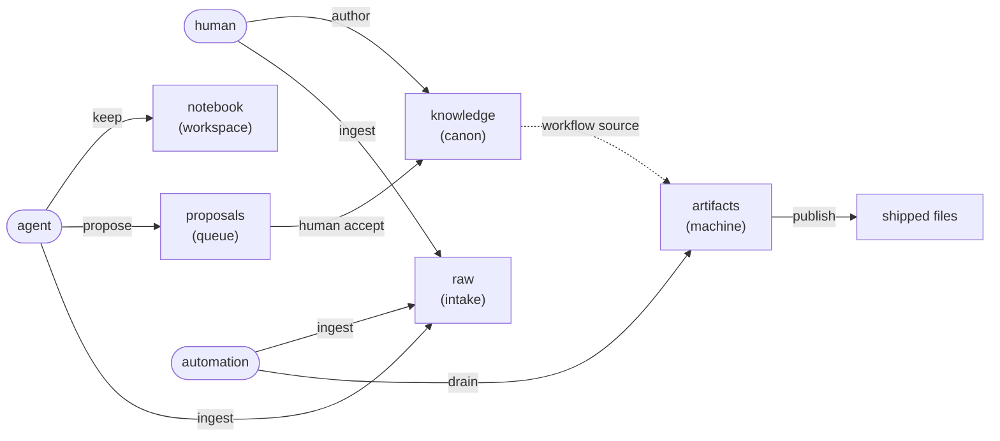
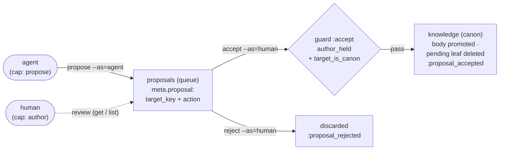

# Concepts — how textus thinks

> **Explanation** · for everyone · **read when** you want the mental model before the reference
> **SSoT for** the textus mental model: lanes/coordination space, the proposal trust path, and the boot/pulse two-channel model · **reviewed** 2026-06 (v0.54)

The shape of your context in textus is a small set of ideas that everything else layers on top of: lanes and the roles that write to them, the entries that live in them, how data flows from input adapters out to published files, and how an agent orients to a store and tracks change. This doc is the mental model — read it once, then reach for the reference docs for exact fields and tables.

## Table of contents

1. [The lane mental model](#the-lane-mental-model)
2. [The proposal trust path](#the-proposal-trust-path)
3. [Two channels: boot & pulse](#two-channels-boot--pulse)

---

## The lane mental model

A textus store is a small **data-flow graph**. Information enters from outside, gets curated by humans and AI, and gets compiled into files you ship. The shape of your context is: lanes, the roles that write to them, the entries that live in them, and how data flows from input adapters out to published files.



*Flow at a glance:* automation converges the `artifacts` machine lane — it produces computed outputs via `drain` and the workflow DSL (using `knowledge` as source); humans write `knowledge` directly (the `author` capability); agents maintain their own `notebook` (the `keep` capability) and `propose` into `proposals`; a human `accept` promotes proposals to `knowledge`; all three actors can `ingest` external source material into the write-once `raw` lane; automation publishes the produced data as shipped files (copied verbatim, or rendered through a per-target ERB template).

Two ideas do all the work:

- **A lane is a write-authority partition.** Each lane declares its `kind:`; the kind decides which capability a writer must hold. Directory names are convention; the manifest is the source of truth.
- **A role is a bundle of capabilities.** A role holds verbs from a closed five-element set — `propose`, `author`, `keep`, `converge`, `ingest` — and may write a lane iff it holds the verb that lane's kind requires. Every `textus put` carries `--as=<role>`, and the writer is refused if that role lacks the required capability. The exact `can:` sets and the kind→capability bijection are the projected [`../reference/authority.md`](../reference/authority.md); what each capability *means* lives in [`../reference/lanes.md`](../reference/lanes.md).

Everything else — workflows, publishing, schemas — is layered on top of those two ideas.

## The proposal trust path

The single edge in the lane diagram from `proposals` to `knowledge` is where the human-in-the-loop lives. It is the only way bytes reach a `canon` lane without already holding `author` — and it is deliberately a two-capability path: an agent can *queue* a change, but only a human can *land* it.



Three ideas make this a *trust* path, not just a copy:

- **Two capabilities, never one.** `propose` lets an agent write into the queue lane (`textus propose` auto-prefixes the key with whatever lane declares `kind: queue`). `author` — the single trust anchor, held by at most one role — is what `accept` requires. An agent has no path to `canon` of its own.
- **`accept` is a transition, not a capability.** It is gated by two floor predicates — **`author_held`** (you hold the anchor) and **`target_is_canon`** (you may only promote *into* a canon lane). A proposal whose `target_key` points elsewhere is refused as `guard_failed`, and `textus doctor`'s `proposal_targets` check flags it ahead of time. The exact predicate set is the SSoT of [`../reference/lanes.md`](../reference/lanes.md).
- **The proposal carries its own destination.** `target_key` and `action` (`put` or `delete`) live in the queued entry's `meta.proposal`, so accept is a *replay* of an intended write — including "propose to delete a canon entry," which travels the same gate. Accept copies the body to the target and deletes the pending leaf; reject just deletes it. Neither lingers; a `proposals.**` upkeep rule (`upkeep: { ttl: 30d, action: drop }`) swept by `textus drain` ages out whatever is never resolved.

## Two channels: boot & pulse

How an AI agent reads from and writes to a textus store comes down to two distinct verbs, on two cadences:

| Verb     | Cadence              | Shape              | Answers                          |
|----------|----------------------|--------------------|----------------------------------|
| `boot`   | once per session     | static contract    | "how do I talk to this store?"   |
| `pulse`  | per turn / per N sec | delta + cursor     | "what changed since I last looked?" |

### Boot — one-shot orientation

```sh
textus boot --output=json
```

Returns the working model of the store: lanes with their kinds and derived write authority, entry families with their schemas, registered workflows, write flows by role, and the full verb catalog. Run this once per session and cache it.

Key field for agents: **`agent_quickstart`**.

```json
{
  "agent_quickstart": {
    "read_verbs":     ["get", "list", "pulse", "schema_show", "boot", "rules"],
    "write_verbs":    ["put KEY --as=agent --stdin"],
    "writable_lanes": ["review"],
    "propose_lane":   "review",
    "latest_seq":     1842
  }
}
```

After boot, the agent knows:
- Which lanes it's allowed to write (gated by the role's capabilities × the lane's kind).
- Where to put proposals (`propose_lane`, usually `proposals`).
- The starting cursor for `pulse` (`latest_seq`).

The boot envelope's top-level key for the verb catalog is `cli_verbs` (not `verbs`). The `agent_quickstart` block is derived from capabilities: `writable_lanes` and `propose_lane` reflect whichever role holds `propose` and is not the accept-anchor (default: `agent`).

### Pulse — recurring delta

```sh
textus pulse --since=<cursor>
```

Returns a delta envelope. The agent advances the cursor each turn.

```json
{
  "cursor":          1845,
  "changed":         [ { "seq": 1843, "key": "knowledge.notes.x", "uid": "...", "verb": "put", "role": "human", "ts": "..." } ],
  "stale":           [ "artifacts.marketplace" ],
  "pending_review":  [ "proposals.proposal.123" ],
  "doctor":          { "ok": true, "warn": 0, "fail": 0 },
  "contract_etag":   "sha256:abc123...",
  "next_due_at":     "2026-05-28T12:34:56Z",
  "hook_errors":     [ { "seq": 1844, "event": "entry_written", "hook": "audit_extra", "key": "knowledge.notes.x", "error_class": "RuntimeError", "error_message": "...", "at": "..." } ]
}
```

`changed` is a thin aggregator over `audit --seq-since=N`. `stale` comes from the internal lifecycle scan (the former `freshness` verb, folded into `pulse` by ADR 0085). `pending_review` lists keys in the `proposals` queue lane. `doctor` is a count summary.

#### Drift, scheduling, and hook-error signals

- **`contract_etag`** — composite sha256 of the contract: `manifest.yaml` plus the hooks and schemas (ADR 0074). If it differs from the value at boot, the contract has drifted; agents should re-`boot`. The MCP server raises `ContractDrift` (-32001) automatically; CLI consumers compare manually.
- **`next_due_at`** — earliest `next_due_at` across all entries with a lifecycle policy, ISO-8601 UTC. Schedulers can sleep until this timestamp instead of polling.
- **`hook_errors`** — list of recent hook failures since cursor: `{seq, event, hook, key, error_class, error_message, at}`. Bounded in-memory ring (256 most recent); older entries are evicted.

Every audit row carries a `seq` integer — a monotonic counter stamped on each write. The `cursor` in pulse is always the `latest_seq` from the audit log; passing it back to the next `pulse --since=<cursor>` produces only rows written after that point.

When pulse returns `changed: []` and `cursor` unchanged from the value you passed, nothing happened. Cheap to poll.

#### Cursor expiry

Audit logs rotate (default: 10MB per file, 5 rotated files kept). If the agent's cached cursor falls off the keep window, pulse raises `CursorExpired`:

```
error: audit cursor expired: requested seq=1842 but oldest available is 5000;
       call `textus boot` to re-orient and resume from latest_seq
```

Handle by calling `boot` again and resuming from the new `latest_seq`. Skip the gap intentionally — those events are gone from local audit storage.

For the 5-minute Claude Code setup and the operational agent loop, see [`../how-to/agents-mcp.md`](../how-to/agents-mcp.md). For the MCP tool catalog, error codes, transports, and retention facts, see [`../reference/mcp.md`](../reference/mcp.md). For the wire protocol, see [`../../SPEC.md`](../../SPEC.md).

## Action architecture

Internal architecture separating verb types:

- **Compositor** — object on `Container` providing write/read/delete/move primitives. Owns serialize, audit, etag checks. Below the auth layer.
- **Unit verb** — thin action class (`Put`, `Get`, `KeyDelete`, `KeyMv`) that delegates directly to the Compositor. Carries the contract DSL for surface projection.
- **Composite verb** — action class (`Accept`, `Propose`, `Reject`) that orchestrates multiple Compositor calls. Declares a `chain` of steps for simple sequences; overrides `#call` for conditionals (e.g. Accept's put vs delete switch). Never instantiates sibling action classes.
- **Chain** — declarative sequence of private methods on a Composite verb, run in order by `Composite#call`. Steps receive `(container:, call:)`.
- **Primitives** — `compositor.write`, `compositor.read`, `compositor.delete`, `compositor.move`. The total interface of the Compositor.
