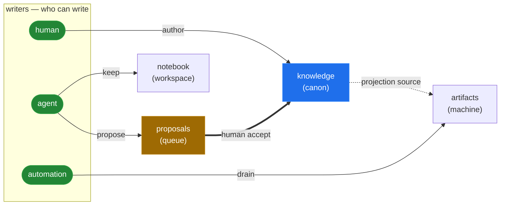

<!-- Generated from .textus/zones/knowledge/readme.md — edit there, then run `textus drain`. Do not hand-edit README.md (it is clobbered on drain and flagged by doctor). ADR 0103. -->
<p align="center">
  <picture>
    <source media="(prefers-color-scheme: dark)" srcset="assets/branding/wordmark-dark.png">
    
  </picture>
</p>

<p align="center">
  <a href="https://github.com/patrick204nqh/textus/actions/workflows/ci.yml"></a>
  <a href="https://rubygems.org/gems/textus"></a>
  <a href="https://rubygems.org/gems/textus"></a>
  <a href="https://www.ruby-lang.org/"></a>
  <a href="LICENSE"></a>
</p>

**A coordination space for humans, AI, and automation.** Your agent forgets between sessions; your notes and `CLAUDE.md` get edited by whoever ran last; nobody can reconstruct who wrote what. textus is durable, multi-writer memory that stays current and survives the model, the session, and the vendor — you keep your space, agents keep theirs, automation keeps external data fresh, and every change crosses a review queue and an audit log.

*textus* is Latin for "the fabric a text is woven from" — same root as *context*, from *con-texere*, "to weave together."

## The idea

Three actors write to your repo today:

- **Humans** — you, your team. Authoritative on identity, decisions, voice.
- **Agents** — Claude, Cursor, custom assistants. Smart, fast, forgetful, and not always right.
- **Automation** — cron jobs, fetchers, CI. Bring outside data in and compile published artifacts.



*Each actor writes only into its own lane; low-trust input climbs to authoritative lanes only by passing a guarded transition (an agent's proposal needs a human `accept`).*
*Colour legend: **green** = writers · **amber** = the review gate (`proposals`) · **blue** = the trust anchor (`knowledge`).*

The point of those lanes is to **build context you can trust**. Place each lane on two axes — how durable it is, and how much you can rely on it without review — and the value shows up as a climb: the high-trust corner (durable *and* authoritative = `knowledge`) is the one place nothing is *written* directly. It's *earned* by crossing the `accept` gate.

```
                       LOW TRUST                     HIGH TRUST
                      (unreviewed)                (authoritative)
              ┌──────────────────────────┬───────────────────────────────┐
DURABLE       │  notebook                │  knowledge  ★ the goal        │
(kept)        │  agent's working truth   │  canon — a human authors      │
              │  durable, but low-trust  │  here · the context you ship  │
              ├──────────────────────────┼───────────────────────────────┤
TRANSIENT     │  artifacts.feeds.*       │  proposals  (queue)           │
(staging)     │  raw external input,     │  a candidate, in review       │
              │  unverified (machine)    │  ▲ climbs via human accept    │
              └──────────────────────────┴───────────────────────────────┘
                raw material ──── propose ────► a human accept lifts it to canon
```

*(The `machine` lane's other half, `artifacts.derived.*`, isn't on this grid — it's a computed **output** projected from the lanes, not an input climbing toward trust.)*

Without coordination, they overwrite each other and nothing remembers why. textus gives each actor a **lane** — called a **zone** in the manifest and CLI, the term used everywhere technical from here on — routes everything they can't write directly through a **proposals queue**, and writes every successful change to an **append-only audit log**. The lanes are enforced at the protocol level, not by convention.

```
knowledge/   author only        — who you are, what you decide, how you sound (knowledge.identity.* for identity facts)
notebook/    keep only          — agent's own durable lane (agents keep theirs; bytes climb to knowledge only via propose→accept)
proposals/   propose (agent + human) — proposals waiting on a human accept
artifacts/   converge only     — machine-maintained: external inputs (artifacts.feeds.*) + computed outputs (artifacts.derived.*)
```

An agent that tries to write directly into `knowledge/` gets `write_forbidden`. It writes to `proposals/` (to change authoritative content) or its own `notebook/` (for working memory). You accept the good proposals; textus promotes them, records the move, and audits both halves. Stable per-entry `uid:` means a reorganization doesn't break references. A monotonic audit cursor (`textus pulse --since=N`) means the next session — possibly a different agent, possibly a different model — picks up exactly where the last one left off.

That's the load-bearing claim: **coordination is a protocol invariant, not a library convenience.**

## See it in four commands

```sh
gem install textus
textus init                          # creates .textus/ with zones + schemas

# an agent proposes a change — it targets a knowledge entry, but lands in proposals/
textus propose notes.oncall --as=agent --stdin <<'JSON'
{
  "_meta": { "name": "oncall",
             "proposal": { "target_key": "knowledge.notes.oncall", "action": "put" } },
  "body": "Patrick on call.\n"
}
JSON

# you accept it — textus promotes to knowledge/ and audits the move
textus accept proposals.notes.oncall --as=human
```

Try the gate the other way (`textus put knowledge.notes.X --as=agent`) and you get `write_forbidden`, with the role that *would* be allowed named in the error. That refusal is the whole point.

## Try it

- **Worked end-to-end store** — the role gate (propose → accept), drain/publish (`CLAUDE.md` / `AGENTS.md` generated from knowledge entries), schemas, templates, and a hook: [`.textus/`](.textus/)
- **Wire textus into Claude Code via MCP** — 4 steps, ~5 minutes: [`docs/how-to/agents-mcp.md`](docs/how-to/agents-mcp.md)

## Protocol, not just a gem

This Ruby gem is the reference implementation of **`textus/3`** — a wire format and storage convention any language can speak. The protocol owns the envelope shape, the role/zone gate, the audit log format, and the key grammar. The gem version (semver, see badge) and the protocol version (`textus/3`) move independently; envelopes carry the `protocol` field so consumers can pin to the contract, not the implementation.

- Specification: [`SPEC.md`](SPEC.md)
- Architecture: [`docs/architecture/README.md`](docs/architecture/README.md)
- Per-release notes: [`CHANGELOG.md`](CHANGELOG.md)

A second implementation in another language would share the same `.textus/` directory and the same audit log. That's deliberate.

## Install

```sh
gem install textus
```

Or from this repo:

```sh
bundle install
bundle exec exe/textus --help
```

## What `textus init` gives you

You get `.textus/` with all four zone directories, baseline schemas, a starter manifest, and a gitignored `.run/` for disposable runtime state (the audit log, per-role cursors, produce locks). Roles declare capabilities; each zone declares a `kind:`, and write authority is derived from the role's capabilities crossed with the zone's kind:

```yaml
roles:
  - { name: human,      can: [author, propose] }
  - { name: agent,      can: [propose, keep] }
  - { name: automation, can: [converge] }

zones:
  - { name: knowledge, kind: canon }      # author    — canonical truth
  - { name: notebook,  kind: workspace }  # keep      — agent's own durable lane
  - { name: proposals, kind: queue }      # propose   — proposals awaiting accept
  - { name: artifacts, kind: machine }    # converge — external inputs (artifacts.feeds.*) + computed outputs (artifacts.derived.*)
```

```
.textus/
  manifest.yaml          # role capabilities + zone kinds + key-to-path mapping
  schemas/               # YAML field shapes per entry family
  templates/             # mustache templates for derived entries
  hooks/                 # one .rb per hook
  .gitignore             # generated — ignores .run/ and any tracked:false entries
  zones/                 # one dir per zone; kinds + capabilities are in the manifest above
    knowledge/           # e.g. identity (knowledge.identity.*), voice, decisions, notes
    notebook/
    proposals/
    artifacts/           # machine lane: feeds/ (external inputs) + derived/ (computed outputs)
  .run/                  # disposable runtime state — gitignored, safe to delete (ADR 0038)
    audit/audit.log      # append-only NDJSON event ledger, every write (rotates at ~50 MB)
    state/cursor.<role>  # per-role pulse cursor — where `pulse --since` resumes
    locks/               # per-key produce locks + the produce mutex
    sentinels/           # publish bookkeeping (target sha) — regenerated on drain (ADR 0070)
```

Manifest `path:` fields are relative to `.textus/zones/`. So `knowledge.notes.org.jane` lives at `.textus/zones/knowledge/notes/org/jane.md`.

Read and write:

```sh
textus get knowledge.notes.org.jane
textus list --zone=knowledge
printf '%s' '{"_meta":{"name":"bob","org":"acme"},"body":"hi\n"}' \
  | textus put knowledge.notes.bob --as=human --stdin
textus drain --as=automation     # re-pull stale inputs + recompute derived outputs
textus rule list                     # show every rule block
textus audit --limit=20              # query the audit log
```

(All verbs return JSON envelopes; `--output=json` is the default and the only format in v1.)

For a worked store — knowledge entries, a staged proposal, schemas, a template, and a `drain` that publishes `CLAUDE.md` / `AGENTS.md` — see [`.textus/`](.textus/).

## What's shipped

- **Per-entry formats & publish.** `format: markdown|json|yaml|text` per entry; a typed `publish:` block (`to:` for file fan-out, `tree:` for a whole-subtree mirror) byte-copies derived files to their consumer paths. ([SPEC §5.2–5.3](SPEC.md))
- **Stable identity.** Auto-minted `uid:` survives writes and `textus key mv`; reorganising never breaks references.
- **Capability × zone-kind gate.** Writes carry `--as=<role>`; a role may write a zone iff it holds the capability the zone's `kind:` requires (`canon`→`author`, `workspace`→`keep`, `machine`→`converge`, `queue`→`propose`). The wrong role gets `write_forbidden` naming the capability needed and the roles that hold it. ([SPEC §5](SPEC.md))
- **Agent loop.** `textus boot` orients a fresh session; `textus pulse --since=N` is the per-turn heartbeat (changed entries, stale keys, pending proposals). ([docs/how-to/agents-mcp.md](docs/how-to/agents-mcp.md))
- **`textus doctor`.** Health checks across schemas, hooks, keys, sentinels, and the audit log.

## CLI and zones

Every command operates on one store, located in this order: `--root <path>` flag → **`TEXTUS_ROOT`** env → walk up from the working directory for a `.textus/` ([SPEC §3.1](SPEC.md)). Write verbs require `--as=<role>`, resolved as: `--as` flag → **`TEXTUS_ROLE`** env → `.textus/role` file → default `human` ([SPEC §5.1](SPEC.md)). Default roles: `human`, `agent`, `automation` (rename or add your own in the manifest's `roles:` block). All verbs accept `--output=json` and return the envelope defined in [SPEC §8](SPEC.md).

- Full verb table — read, write, health, scaffolding — is in [SPEC §9](SPEC.md).
- Zone semantics and the capability × zone-kind mapping live in [SPEC §5](SPEC.md), with the reference in [`docs/reference/zones.md`](docs/reference/zones.md).

`textus boot` prints the same information for the current store: zones, entry families with schemas, registered hooks, write flows, and the verb catalog. Run it inside a store and you get the live picture; reach for the SPEC when you want the contract.

## Produce and publish

Produced entries (`kind: produced`) declare how they're acquired in one `source:` block (ADR 0093/0094); `drain` materialises them:

- **`source: { from: project, select: [...], pluck:, sort_by:, limit:, transform: name }`** — a *projection*: textus computes the entry's data from other entries, then renders it through a template under `.textus/templates/` (markdown/text) or a templateless path that lets a transform hook shape the output directly (json/yaml). Projections cap at 1000 rows; the vendored Mustache subset caps at depth 8. No partials, no lambdas, no HTML escaping.
- **`source: { from: handler, handler: name, ttl: 1h, config: {...} }`** — *intake*: an RPC handler pulls external bytes on a `ttl` cadence; `drain` re-pulls when the entry goes stale.
- **`source: { from: command, sources: [...] }`** — *externally generated*: an out-of-band command writes the file; textus tracks the declared `sources` for staleness.

Publishing is one typed `publish:` block (ADR 0052). `publish: { to: [path, ...] }` byte-copies a single produced file to one or more targets. `publish: { tree: "dir" }` on a nested entry mirrors its whole stored subtree to one target directory, preserving layout (path-driven — no keys or template variables). Sentinels for every published file live under `.textus/.run/sentinels/` (git-ignored runtime state, regenerated on drain — ADR 0070). See SPEC §5.2, §5.3, §5.12.

## Extension points

textus exposes a hook DSL. Drop `.rb` files into `.textus/hooks/` (subdirectories are fine; files load alphabetically by full path). There are two kinds:

**RPC hooks** — one handler, the framework uses what you return:

| Event | Fires when | You return |
|---|---|---|
| `:resolve_handler` | an intake needs bytes | `{_meta:, body:}` |
| `:transform_rows` | a projection builds | the reshaped rows |
| `:validate` | `textus doctor` runs | doctor issues (or none) |

**Pub-sub hooks** — 0..N handlers, fire-and-react (no return value):

| Event(s) | Fires when |
|---|---|
| `:entry_written` · `:entry_deleted` · `:entry_renamed` | a write lands |
| `:entry_fetched` | an intake-driven write lands |
| `:entry_produced` | a produced entry materializes |
| `:entry_published` | a produced file is copied to its target |
| `:proposal_accepted` · `:proposal_rejected` | a proposal is resolved |
| `:entry_fetch_started` · `:entry_fetch_failed` · `:produce_failed` | produce lifecycle |
| `:store_loaded` · `:session_opened` | the store loads · a role connects |

```ruby
# Inside .textus/hooks/local_file.rb
Textus.hook do |reg|
  reg.on(:resolve_handler, :local_file) do |config:, args:, **|
    path = config["path"] or raise "local-file requires source.config.path"
    {
      _meta: { "last_fetched_at" => Time.now.utc.iso8601, "source_path" => path },
      body: File.read(File.expand_path(path)),
    }
  end
end
```

```ruby
Textus.hook do |reg|
  reg.on(:transform_rows, :rank_by_recency) do |rows:, **|
    rows.sort_by { |r| r["updated_at"].to_s }.reverse
  end
end
```

Stale intake entries are re-pulled by `drain`, not by reads — `get` is a pure
read that annotates the returned envelope with a freshness verdict (ADR 0089).
`drain` re-pulls anything past its `source.ttl` and recomputes derived outputs:

```sh
textus drain --as=automation                  # re-pull every stale intake + recompute derived
textus drain artifacts.feeds --as=automation  # scope to one prefix
textus get artifacts.feeds.calendar.events         # a pure read; carries a freshness verdict
```

See SPEC.md §5.10 for the full hook contract.

Schemas (`.textus/schemas/<name>.yaml`) declare field shapes, per-field `maintained_by:` ownership, and an `evolution:` block (`added_in`, `deprecated_at`, `migrate_from`). Full contract in SPEC §5.8.

See [`docs/how-to/agents-mcp.md`](docs/how-to/agents-mcp.md) for the agent boot → pulse loop.

## Examples

[`.textus/`](.textus/) — textus as a project's own context store (a fictional Rails service, `ledger`). Human-authored `knowledge/` (project facts, runbooks), a staged ADR in `proposals/` showing the agent-propose / human-accept loop, schemas validating each family, a mustache template plus a `:transform_rows` hook, and a `drain` that publishes the `artifacts.derived.orientation` projection to `CLAUDE.md` and `AGENTS.md`. Includes a copy-paste adoption recipe for your own repo.

## Tests

```sh
bundle exec rspec
```

Includes conformance fixtures A–I from SPEC §12.

## Code quality

```sh
bundle exec rubocop      # lint
bundle exec rubocop -A   # lint + autocorrect
```

Lefthook hooks (`brew bundle install` then `lefthook install`) run rubocop on `pre-commit` and `rspec + rubocop` on `pre-push`. Bypass with `LEFTHOOK=0 git commit ...` when needed. CI runs `rspec` (Ruby 3.3 / 3.4) and `rubocop` via GitHub Actions.

## License

[MIT](LICENSE)
