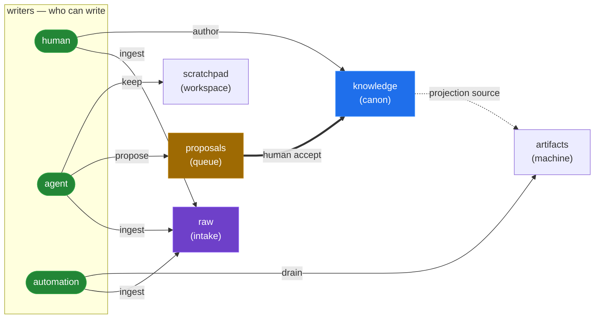

<!-- This is a fragment of the README. Edit here; the README is composed from fragments by a workflow. -->
## The idea

Three actors write to your repo today:

- **Humans** — you, your team. Authoritative on identity, decisions, voice.
- **Agents** — Claude, Cursor, custom assistants. Smart, fast, forgetful, and not always right.
- **Automation** — cron jobs, fetchers, CI. Bring outside data in and compile published artifacts.



*Each actor writes only into its own lane; low-trust input climbs to authoritative lanes only by passing a guarded transition (an agent's proposal needs a human `accept`).*
*Colour legend: **green** = writers · **amber** = the review gate (`proposals`) · **blue** = the trust anchor (`knowledge`) · **purple** = write-once intake (`raw`).*

The point of those lanes is to **build context you can trust**. Place each lane on two axes — how durable it is, and how much you can rely on it without review — and the value shows up as a climb: the high-trust corner (durable *and* authoritative = `knowledge`) is the one place nothing is *written* directly. It's *earned* by crossing the `accept` gate.

```
                       LOW TRUST                     HIGH TRUST
                      (unreviewed)                (authoritative)
              ┌──────────────────────────┬───────────────────────────────┐
DURABLE       │  scratchpad                │  knowledge  ★ the goal        │
(kept)        │  agent's working truth   │  canon — a human authors      │
              │  durable, but low-trust  │  here · the context you ship  │
              ├──────────────────────────┼───────────────────────────────┤
TRANSIENT     │  artifacts  (outputs)    │  proposals  (queue)           │
(staging)     │  computed, machine-made  │  a candidate, in review       │
              │  raw        (inputs)     │  ▲ climbs via human accept    │
              │  ingested, write-once    │                               │
              └──────────────────────────┴───────────────────────────────┘
                raw material ──── propose ────► a human accept lifts it to canon
```

Without coordination, they overwrite each other and nothing remembers why. textus gives each actor a **lane** — enforced at the protocol level, not by convention — routes everything they can't write directly through a **proposals queue**, and writes every successful change to an **append-only audit log**.

```
knowledge/   author only            — who you are, what you decide, how you sound
scratchpad/    keep only              — agent's own durable lane (bytes climb to knowledge only via propose→accept)
proposals/   propose (agent+human) — proposals waiting on a human accept
artifacts/   converge only         — machine-maintained: computed outputs + external inputs
```

An agent that tries to write directly into `knowledge/` gets `write_forbidden`. It writes to `proposals/` (to change authoritative content) or its own `scratchpad/` (for working memory). You accept the good proposals; textus promotes them, records the move, and audits both halves. Stable per-entry `uid:` means a reorganization doesn't break references. A monotonic audit cursor (`textus pulse --since=N`) means the next session — possibly a different agent, possibly a different model — picks up exactly where the last one left off.

That's the load-bearing claim: **coordination is a protocol invariant, not a library convenience.**
