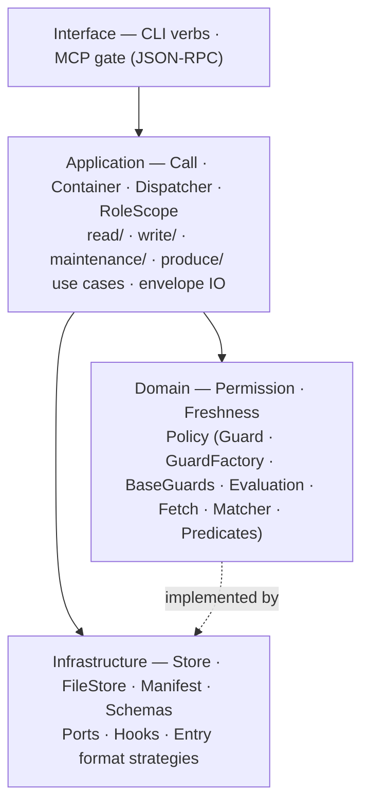

# Textus architecture

> **Explanation** · for contributors · **read this first** for orientation before SPEC
> **SSoT for** the Ruby implementation layout (layers, container, ports, read/write/produce paths) · **reviewed** 2026-06 (v0.45)



*Dependency rule: arrows point down.* Domain performs no direct `File`/`Dir`/`Time.now` I/O — all disk and clock access is routed through injected ports; pure path math is allowed. Application imports Domain + Ports. Use cases are plain classes on `(container:, call:)`. Verbs are looked up in the static `Dispatcher::VERBS` table.

### What lives in each layer

**Interface**

```
CLI verbs:  store.<verb>(..., role:)
            store.as(role).<verb>(...)    # (put/get/fetch/…)

MCP gate:   textus mcp serve — same use cases, JSON-RPC.
```

The CLI is a **projection of the per-verb `Contract`** (ADR 0063), the operator
mirror of `MCP::Catalog`. The contract now owns the whole request lifecycle —
`acquire → bind → invoke → render` (ADRs 0066–0068): one `Contract::Binder.bind`
splits the uniform by-name `inputs` hash into the use-case's positional/keyword
args for every surface; per-surface `view`s shape the output (`view` for
MCP/Ruby, `view(:cli)` for the operator envelope); declarative `source:`/
`coerce:`/`cli_stdin` populate inputs from files and stdin; `around:` resources
wrap the single dispatch site (`RoleScope#dispatch_bound`) for stateful verbs;
and `cli_default:` declares a CLI default that diverges from the agent default.
`CLI::Runner` generates a command per `:cli` contract, dispatching `contract.verb`
by construction. Only verbs with genuine *behavior* — `put` (entry persistence),
`get` (UnknownKey + resolver suggestions, CLI-only), and `doctor` (not yet
generatable) — stay hand-authored, plus commands with no dispatcher verb (`init`,
`hook`, `mcp serve`, `schema diff/init`). `boot` is auto-generated from its
contract. Total reconciliation specs make name/dispatch/facet drift unrepresentable.

**Application**

```
Call             (slim Data: role, correlation_id, now,
                  dry_run — request state only)
Container        (single record — wired ports + manifest)
Dispatcher       (static VERBS table: verb → use-case)
RoleScope        (Store#as(role) — forwards verb calls)

read/{get,list,where,uid,schema_envelope,
      deps,rdeps,published,validate_all,boot,doctor,
      freshness,audit,blame,rule_explain,rule_list,pulse}.rb
write/{put,key_delete,key_mv,accept,reject,propose}.rb
maintenance/{reconcile,key_mv_prefix,key_delete_prefix,
             zone_mv,rule_lint}.rb
produce/{engine,events,render,
         acquire/{intake,handler,projection,serializer}}.rb
envelope/io/{reader,writer}.rb  (split: parse vs persist)
projection.rb
```

**Domain**

```
Permission         (write predicate per zone)
Freshness::{Verdict,Evaluator}
Action  Outcome  Sentinel
Policy::{Guard,GuardFactory,BaseGuards,Evaluation,Fetch,Matcher,HandlerAllowlist,
         Predicates::{ZoneWritableBy,SchemaValid,AuthorHeld,TargetIsCanon,EtagMatch,FreshWithin}}
```

**Infrastructure**

```
Store              (composition root — wires ports,
                    vends a Container + dispatches verbs)
Storage::FileStore (bytes-only port: read/write/delete/
                    exists?/etag)
Manifest           (Data, Resolver, Policy, Rules)
Schemas            (eager-load cache)
Ports::{AuditLog,AuditSubscriber,Publisher,Clock,
        BuildLock,ProduceOnWriteSubscriber,SentinelStore}
Hooks::{EventBus,RpcRegistry,Loader,Context,FireReport,
        Signature,Builtin,ErrorLog}
Entry::{Markdown,Json,Yaml,Text}  (format strategies)
```

## How a verb becomes a method

Each application use case is a plain class under `lib/textus/{read,write,maintenance}/`. The shape is uniform:

```ruby
module Textus
  module Read
    class Get
      def initialize(container:, call:)
        @container = container
        @call      = call
      end

      def call(key)
        ...
      end
    end
  end
end
```

Verbs are looked up in a static frozen table (`Textus::Dispatcher::VERBS`) that maps `:get → Textus::Read::Get`, `:put → Textus::Write::Put`, etc. `Store#put` / `Store#get` / `Store#as(role).<verb>(...)` instantiate the use case on `(container:, call:)` and invoke `#call`. Adding a new verb is **one entry in `Dispatcher::VERBS`** plus the class — no metaprogramming.

The instantiate-and-call step itself has one home: `Dispatcher.invoke(verb, container:, call:, args:, kwargs:)` (ADR 0026). `RoleScope` builds the `Call` (request state) and delegates the dispatch to `Dispatcher.invoke`; the convention for invoking a uniform-shape use case lives next to the table that maps the verbs, not re-spelled in the caller. `Store`'s own verb loop is separate — it extracts the `role:` keyword and forwards to `as(role)`, a role-selection job distinct from invocation.

`boot` and `doctor` are read verbs like any other: `Read::Boot` / `Read::Doctor`
are thin `(container:, call:)` use cases that delegate to the `Textus::Boot` /
`Textus::Doctor` report-building libraries (`build(container:, ...)`). They are
reached through `Dispatcher::VERBS`, not a special method on `RoleScope`.

Two collaborators live outside the dispatcher because they're composed by other use cases, not invoked as verbs:

- `Produce::Engine` — runs `reconcile`'s produce pipeline; composes `Acquire::Intake` (external pull via handler) with `Produce::Render` (template-driven publish) per entry. `AsyncRunner` (nested in `Engine`) enqueues reactive re-produce on `entry_written` events and drains before the process exits.
- `Envelope::IO::{Reader,Writer}` — own the parse and persist halves of the write pipeline; the audit-append-as-final-step invariant lives in `Writer`.

## Container

Use cases never see the raw `Store`. `Textus::Container` is a single record holding the wired collaborators:

```ruby
Container = Data.define(
  :manifest, :file_store, :schemas, :root,
  :audit_log, :events, :rpc
)
```

The `Store` builds one `Container` at boot; every use case receives it via `(container:, call:)`. RPC hook callables (`:resolve_handler`, `:transform_rows`, `:validate`) receive `caps: <Container>` — field names match what the prior `WriteCaps` exposed, so handlers reading `caps.manifest`, `caps.events`, etc. continue to work.

## Ports

Ports are infrastructure adapters with an interface defined by the domain. Each port is independently replaceable — swap the implementation for tests or alternative runtimes without touching application or domain code.

| Class | Role |
|---|---|
| `Ports::Storage::FileStore` | Bytes-only FS I/O — `read`, `write`, `delete`, `exists?`, `etag`. No knowledge of envelopes or schemas. |
| `Ports::AuditLog` | Append-only structured log (`audit.log`). Owns seq numbering, file-locking, and rotation. |
| `Ports::Clock` | Supplies `Time.now` — a module-function so tests can swap it without dependency injection boilerplate. |
| `Ports::Publisher` | Copies a built artifact to a repo-relative consumer path and writes a sentinel so the next publish can confirm the target is managed. |
| `Ports::BuildLock` | Process-exclusive `flock` guard over the produce pipeline. Raises `BuildInProgress` if a build is already running. |
| `Ports::ProduceOnWriteSubscriber` | Pub-sub listener on `entry_written`; enqueues keys into `Produce::Engine::AsyncRunner` for reactive re-produce after any write. |
| `Ports::SentinelStore` | Reads and writes the per-target sentinel file that `Publisher` uses to detect unmanaged overwrites. |

Application use cases access ports only through `Container` fields — never through the raw `Store`.

### EnvelopeIO

`Envelope::IO::Reader` and `Envelope::IO::Writer` split the envelope pipeline into read-only parse and write-with-audit halves.

**Reader** (`lib/textus/envelope/io/reader.rb`) — resolves a key through `manifest.resolver`, reads bytes via `FileStore`, delegates parsing to the format strategy (`Entry.for_format`), and returns an `Envelope`. No audit, no events, no permission checks. Also used by `Writer` for the existing-uid lookup on `put`.

**Writer** (`lib/textus/envelope/io/writer.rb`) — owns the full write pipeline: serialize → schema-validate → etag-check → `FileStore#write` → `AuditLog#append`. The class comment states the invariant directly: every public method's final action is `@audit_log.append(...)`. If the audit append fails, the caller sees the underlying error — the byte write already happened, but the pipeline contract treats audit as the commit step. No permission check, no event firing — those stay in the calling use case (`Write::Put`, `Write::Delete`, `Write::Mv`).

The three public methods are `put`, `delete`, and `move`; all follow the same validate → write → audit sequence.

Both are built from a `Container` via named constructors — `Writer.from(container:, call:)` (which builds its own `Reader.from`) and `Reader.from(container:)` (ADR 0026). Write use cases call `Writer.from` rather than reconstructing the object graph by hand, so a change to the Writer's dependencies is a one-line edit in one place.

## Manifest carving

Manifest carving means slicing the parsed manifest YAML into four purpose-specific sub-objects. Each consumer sees only the fields it needs; none reach into the full raw document.

`Manifest` itself is a `Data.define` struct — a composition record with four named members:

| Member | Class | Responsibility |
|---|---|---|
| `data` | `Manifest::Data` | Frozen value: `raw`, `root`, `zones`, `entries`, `audit_config`, `role_caps` (role name → capability set). Structural data only — no behaviour beyond accessors and key validation. |
| `resolver` | `Manifest::Resolver` | Key → `Resolution(entry, path, remaining)`. Handles nested entry enumeration and fuzzy-match suggestions. |
| `policy` | `Manifest::Policy` | Zone/capability authority — `verb_for_zone` (zone-kind → required verb), `roles_with_capability(verb)`, `zone_writers` (derived: roles holding the verb the zone's kind requires), `permission_for`, `declared_kind`, `proposer_role`, `propose_zone_for(role)`. Write authority is derived from capabilities × zone-kind (ADR 0030); no filesystem I/O. `propose_zone_for` returns the single `kind: queue` zone when the role can write it (ADR 0027). |
| `rules` | `Manifest::Rules` | Pattern-matched rule engine. `rules.for(key)` returns a `RuleSet(fetch, handler_allowlist, guard, retention)` by evaluating all `match:` blocks against the key. |

Rationale: cleaner test seams — a use case that only needs key resolution constructs a `Manifest::Resolver` from a stub `Data`; one that only needs rule lookup constructs a `Manifest::Rules` directly. No consumer is forced to build the full manifest to exercise one sub-view.

The four members are wired in `Manifest.build` (`lib/textus/manifest.rb`). `Manifest::Data` constructs `Policy` internally during `initialize`; the others are assembled by the loader and handed in as named arguments.

## Read path (`store.get(key)`)

`Read::Get` is the single public read verb. It is a **pure read** (ADR 0089): it resolves the path, reads bytes, parses the envelope, and annotates a freshness verdict — it NEVER ingests and NEVER mutates. The read-through that once refreshed a stale entry in-process (ADR 0062) is removed; quarantine freshness is system-pushed via `reconcile` (scheduled sweep) and `hook run` (event push).

1. CLI verb (or MCP tool) calls `store.get(key, role:)` (or `store.as(role).get(key)`).
2. `Store#get` looks up `Dispatcher::VERBS[:get] → Read::Get`, builds a `Call`, instantiates `Read::Get.new(container:, call:).call(key)`. The verb takes only `key` — there is no `fetch` flag on any surface.
3. `Read::Get#call(key)` resolves the path through `container.manifest`, reads bytes via `container.file_store`, parses the envelope, and annotates a freshness verdict (`stale`, `reason`, `fetching: false`). When the key has no `upkeep` rule, the envelope is annotated fresh. A stale entry with `upkeep: { ttl:, action: refresh }` is returned **stale** — the read does not refresh it; the next `reconcile` does.

Because the read is always pure, every caller — interactive reads, dashboards, and the direct in-process callers (accept/reject/publish, materializer, uid, validate_all/validator, schema/tools, hooks/context) — gets the same orchestrator-free, side-effect-free read. The prior read-through path (`get_or_fetch`, then the `fetch:`-flagged `Read::Get`, ADR 0062) and its `Write::FetchOrchestrator` are gone (ADR 0089).

## Write path (`store.put(key, ...)`)

1. CLI verb calls `store.put(key, meta:, body:, content:, if_etag:, role:)`.
2. `Write::Put#call` validates the key, resolves the manifest entry, builds `GuardFactory.for(:put, key)` and calls `Guard#check!(eval)` (topology is predicate #0, `zone_writable_by`) — raises `WriteForbidden` if the topology gate denies, `GuardFailed` if any other predicate fails.
3. Delegates persistence to `Envelope::IO::Writer#put`, which serializes, schema-validates, etag-checks (raises `EtagMismatch` on conflict), writes via the `FileStore` port, and appends the audit row.
4. Publishes `:entry_written` via `container.events` with `ctx: <Hooks::Context>`, `key:`, `envelope:`.

`Write::{KeyDelete,KeyMv,Accept,Reject,Propose}` follow the same shape: explicit container, the unified `Guard` for authz (built per transition via `GuardFactory`), `Envelope::IO::Writer` for persistence (where applicable), event published with the `Hooks::Context` handle.

`Write::KeyMv` delegates the file-move + audit to `Envelope::IO::Writer#move`, then publishes `:entry_renamed` itself. UID injection (when the source lacks one) goes through `Envelope::IO::Writer#write` directly — no `Put` bypass.

## Produce path (`reconcile` + reactive `entry_written`)

The produce pipeline handles two concerns — **acquire** (pull live data via an intake handler) and **render** (template-driven artifact publish) — unified under `Produce::Engine`.

`Produce::Engine.converge(container:, call:, keys:)` is the entry point for both `reconcile` (scheduled batch) and the reactive `AsyncRunner` (triggered on `entry_written` by `Ports::ProduceOnWriteSubscriber`).

For each key, `Engine#produce_one`:

1. **Acquire phase** — `Produce::Acquire::Intake#run(key)`:
   - Resolves the manifest entry; looks up the intake handler via `container.rpc.callable(:resolve_handler, mentry.handler)`.
   - Publishes `:entry_fetch_started` via `Produce::Events`.
   - Invokes the handler under a timeout deadline.
   - On error: publishes `:entry_fetch_failed`, re-raises.
   - On success: normalises the result through `Acquire::Serializer` (JSON/YAML/text), checks guard, persists via `Envelope::IO::Writer`, publishes `:entry_fetched` unless the etag is unchanged.
   - `Acquire::Handler` resolves the RPC callable; `Acquire::Projection` maps handler output to the envelope's body/meta shape.
2. **Render phase** — `entry.publish_via(context)` calls `Produce::Render#bytes_for(target:, data:, boot:)` to expand the Liquid template and copy the result to the publish target via `Ports::Publisher`. Returns `nil` if no publish is configured (skipped).

`AsyncRunner` (nested in `Engine`) enqueues reactive produce when `entry_written` fires, then drains before the process exits via an `at_exit` hook. A held `BuildLock` is a soft miss — the in-flight build already produces fresh output.

## Hook payload contract

Pub-sub hooks (`:entry_written`, `:entry_fetched`, …) receive `ctx:` — a `Textus::Hooks::Context` that exposes a narrow surface (`get`, `list`, `put`, `delete`, `audit`, `publish_followup`, plus `role` and `correlation_id`). The raw `Store` is not handed out.

RPC hooks (`:resolve_handler`, `:transform_rows`, `:validate`) receive `caps:` — a `Textus::Container`. They are gem-internal: the framework calls them, not user pub-sub.

## Agent surface (boot + pulse + MCP)

Agents and plugins talk to a textus store through three layers:

```
soul (skill/agent)  ──▶  gate (CLI | MCP)  ──▶  Store  ──▶  memory (.textus/)
```

Two transports, one façade:

- **CLI** — human/script surface. `textus boot`, `textus pulse --since=N`, `textus get/put/...`.
- **MCP** — agent surface. `textus mcp serve` runs a stdio JSON-RPC 2.0 server speaking MCP draft 2024-11-05. Tools are auto-derived from the manifest. Session state (cursor, role, contract_etag) is server-side.

Both transports call `store.<verb>(..., role:)` (or `store.as(role).<verb>(...)`). No duplicate logic.

The agent loop (cadence guide in [`agents-mcp.md`](../how-to/agents-mcp.md)):

1. **Session start:** `boot()` → contract envelope (zones, entries, schemas, write_flows, agent_quickstart with `latest_seq`).
2. **Per turn:** `pulse(since=cursor)` → `{cursor, changed, stale, pending_review, doctor}`.
3. **On demand:** `get`, `put`, `propose`, `fetch`, `schema_show`, `rule_explain`.

Contract drift surfaces as `ContractDrift` (contract_etag mismatch — a change to the manifest, hooks, or schemas; ADR 0074); audit cursor falls off the keep window as `CursorExpired`. Both signal "call `boot` again."

## Hooks event catalog

`Hooks::Signature` is the single home of callable keyword-introspection — both `EventBus` (pub-sub dispatch) and `RpcRegistry` (RPC dispatch) delegate to it for `accepts_keyrest?`, `declared_keys`, `missing`, and `filter` rather than each maintaining a hand-rolled copy (ADR 0027). RPC handlers declare `caps:` (single handler); pub-sub handlers declare `ctx:` (0..N handlers).

The event names, payloads, and per-verb firing order are documented once in [`reference/events.md`](../reference/events.md) (the friendly SSoT); the authoritative source is `lib/textus/hooks/catalog.rb` (`Catalog::RPC` and `Catalog::PUBSUB`).
