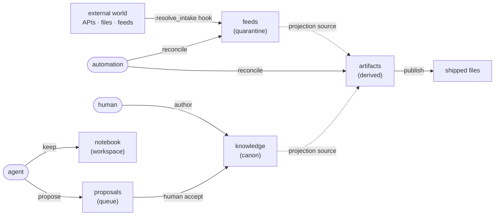
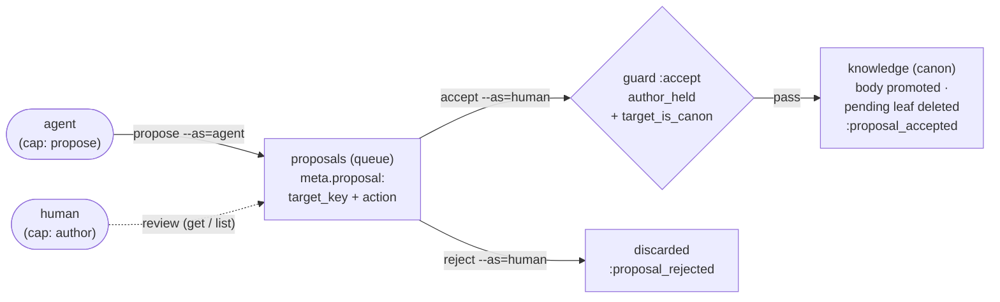

# Concepts — how textus thinks

> **Explanation** · for everyone · **read when** you want the mental model before the reference
> **SSoT for** the textus mental model: zones/coordination space, the proposal trust path, RPC vs pub-sub, and the boot/pulse two-channel model · **reviewed** 2026-06 (v0.39)

The shape of your context in textus is a small set of ideas that everything else layers on top of: zones and the roles that write to them, the entries that live in them, how data flows from input adapters out to published files, how hooks extend each verb, and how an agent orients to a store and tracks change. This doc is the mental model — read it once, then reach for the reference docs for exact fields and tables.

## Table of contents

1. [The zone mental model](#the-zone-mental-model)
2. [The proposal trust path](#the-proposal-trust-path)
3. [Hooks: RPC vs pub-sub](#hooks-rpc-vs-pub-sub)
4. [Two channels: boot & pulse](#two-channels-boot--pulse)

---

## The zone mental model

A textus store is a small **data-flow graph**. Information enters from outside, gets curated by humans and AI, and gets compiled into files you ship. The shape of your context is: zones, the roles that write to them, the entries that live in them, and how data flows from input adapters out to published files.



*Flow at a glance:* automation reconciles the machine-maintained lanes — it pulls external bytes into `feeds` and materializes `artifacts` from `knowledge`/`feeds`, both under the one `reconcile` capability; humans write `knowledge` directly (the `author` capability); agents maintain their own `notebook` (the `keep` capability) and `propose` into `proposals`; a human `accept` promotes proposals to `knowledge`; automation publishes the materialized artifacts as shipped files.

Two ideas do all the work:

- **A zone is a write-authority partition.** Each zone declares its `kind:`; the kind decides which capability a writer must hold. Directory names are convention; the manifest is the source of truth.
- **A role is a bundle of capabilities.** A role holds verbs from a closed four-element set — `propose`, `author`, `keep`, `reconcile` — and may write a zone iff it holds the verb that zone's kind requires. Every `textus put` carries `--as=<role>`, and the writer is refused if that role lacks the required capability. The exact `can:` sets and the kind→verb table are the SSoT of [`../reference/zones.md`](../reference/zones.md).

Everything else — projections, publishing, hooks, schemas — is layered on top of those two ideas.

## The proposal trust path

The single edge in the zone diagram from `proposals` to `knowledge` is where the human-in-the-loop lives. It is the only way bytes reach a `canon` zone without already holding `author` — and it is deliberately a two-capability path: an agent can *queue* a change, but only a human can *land* it.



Three ideas make this a *trust* path, not just a copy:

- **Two capabilities, never one.** `propose` lets an agent write into the queue zone (`textus propose` auto-prefixes the key with whatever zone declares `kind: queue`). `author` — the single trust anchor, held by at most one role — is what `accept` requires. An agent has no path to `canon` of its own.
- **`accept` is a transition, not a capability.** It is gated by two floor predicates — **`author_held`** (you hold the anchor) and **`target_is_canon`** (you may only promote *into* a canon zone). A proposal whose `target_key` points elsewhere is refused as `guard_failed`, and `textus doctor`'s `proposal_targets` check flags it ahead of time. The exact predicate set is the SSoT of [`../reference/zones.md`](../reference/zones.md).
- **The proposal carries its own destination.** `target_key` and `action` (`put` or `delete`) live in the queued entry's `meta.proposal`, so accept is a *replay* of an intended write — including "propose to delete a canon entry," which travels the same gate. Accept copies the body to the target and deletes the pending leaf; reject just deletes it. Neither lingers; a `proposals.**` upkeep rule (`upkeep: { "on": stale, action: drop }`) swept by `textus reconcile` ages out whatever is never resolved.

## Hooks: RPC vs pub-sub

You extend textus with Ruby hooks. The whole mental model is one distinction in ~20 lines; the per-event arguments, lifecycle timelines, and how to define and test a hook are reference you can skim on demand. Every event is one of two kinds.

```
   RPC                              PUB-SUB
   ───                              ───────
   • exactly 1 handler              • 0..N handlers
   • return value is USED           • return value is DISCARDED
   • raised error ABORTS the verb   • raised error LOGGED, verb continues
   • named explicitly by manifest   • triggered by lifecycle, filtered by keys:

   :resolve_intake → input to the store     :entry_put          → after any write
   :transform_rows → projection shaping     :entry_deleted      → after delete
   :validate       → doctor checks          :entry_fetched      → after fetch
                                            :build_completed    → after derived materialization
                                            :proposal_accepted  → after pending → target promotion
                                            :file_published     → after each file written to a repo path
                                            :entry_renamed      → after rename
                                            :proposal_rejected  → after proposal discard
                                            :store_loaded       → once per Store.new
                                            :fetch_started      → before intake handler runs
                                            :fetch_failed       → intake handler raised
                                            :fetch_backgrounded → timed_sync budget exceeded
```

**RPC events steer the verb's data. Pub-sub events observe the verb's outcome.** That's the whole model. For the full event catalog, per-verb lifecycle timelines, and `ctx:` fields, see [`../reference/events.md`](../reference/events.md).

## Two channels: boot & pulse

How an AI agent reads from and writes to a textus store comes down to two distinct verbs, on two cadences:

| Verb     | Cadence              | Shape              | Answers                          |
|----------|----------------------|--------------------|----------------------------------|
| `boot`   | once per session     | static contract    | "how do I talk to this store?"   |
| `pulse`  | per turn / per N sec | delta + cursor     | "what changed since I last looked?" |

### Boot — one-shot orientation

```sh
textus boot --output=json
```

Returns the working model of the store: zones with their kinds and derived write authority, entry families with their schemas, registered hooks, write flows by role, and the full verb catalog. Run this once per session and cache it.

Key field for agents: **`agent_quickstart`**.

```json
{
  "agent_quickstart": {
    "read_verbs":     ["get", "list", "pulse", "schema_show", "boot", "rules"],
    "write_verbs":    ["put KEY --as=agent --stdin"],
    "writable_zones": ["review"],
    "propose_zone":   "review",
    "latest_seq":     1842
  }
}
```

After boot, the agent knows:
- Which zones it's allowed to write (gated by the role's capabilities × the zone's kind).
- Where to put proposals (`propose_zone`, usually `review`).
- The starting cursor for `pulse` (`latest_seq`).

The boot envelope's top-level key for the verb catalog is `cli_verbs` (not `verbs`). The `agent_quickstart` block is derived from capabilities: `writable_zones` and `propose_zone` reflect whichever role holds `propose` and is not the accept-anchor (default: `agent`).

### Pulse — recurring delta

```sh
textus pulse --since=<cursor>
```

Returns a delta envelope. The agent advances the cursor each turn.

```json
{
  "cursor":          1845,
  "changed":         [ { "seq": 1843, "key": "knowledge.notes.x", "uid": "...", "verb": "put", "role": "human", "ts": "..." } ],
  "stale":           [ "artifacts.marketplace" ],
  "pending_review":  [ "proposals.proposal.123" ],
  "doctor":          { "ok": true, "warn": 0, "fail": 0 },
  "contract_etag":   "sha256:abc123...",
  "next_due_at":     "2026-05-28T12:34:56Z",
  "hook_errors":     [ { "seq": 1844, "event": "entry_put", "hook": "audit_extra", "key": "knowledge.notes.x", "error_class": "RuntimeError", "error_message": "...", "at": "..." } ]
}
```

`changed` is a thin aggregator over `audit --seq-since=N`. `stale` comes from the internal lifecycle scan (the former `freshness` verb, folded into `pulse` by ADR 0085). `pending_review` lists keys in the queue zone. `doctor` is a count summary.

#### Drift, scheduling, and hook-error signals

- **`contract_etag`** — composite sha256 of the contract: `manifest.yaml` plus the hooks and schemas (ADR 0074). If it differs from the value at boot, the contract has drifted; agents should re-`boot`. The MCP server raises `ContractDrift` (-32001) automatically; CLI consumers compare manually.
- **`next_due_at`** — earliest `next_due_at` across all entries with a lifecycle policy, ISO-8601 UTC. Schedulers can sleep until this timestamp instead of polling.
- **`hook_errors`** — list of recent hook failures since cursor: `{seq, event, hook, key, error_class, error_message, at}`. Bounded in-memory ring (256 most recent); older entries are evicted.

Every audit row carries a `seq` integer — a monotonic counter stamped on each write. The `cursor` in pulse is always the `latest_seq` from the audit log; passing it back to the next `pulse --since=<cursor>` produces only rows written after that point.

When pulse returns `changed: []` and `cursor` unchanged from the value you passed, nothing happened. Cheap to poll.

#### Cursor expiry

Audit logs rotate (default: 10MB per file, 5 rotated files kept). If the agent's cached cursor falls off the keep window, pulse raises `CursorExpired`:

```
error: audit cursor expired: requested seq=1842 but oldest available is 5000;
       call `textus boot` to re-orient and resume from latest_seq
```

Handle by calling `boot` again and resuming from the new `latest_seq`. Skip the gap intentionally — those events are gone from local audit storage.

For the 5-minute Claude Code setup and the operational agent loop, see [`../how-to/agents-mcp.md`](../how-to/agents-mcp.md). For the MCP tool catalog, error codes, transports, and retention facts, see [`../reference/mcp.md`](../reference/mcp.md). For the wire protocol, see [`../../SPEC.md`](../../SPEC.md).
