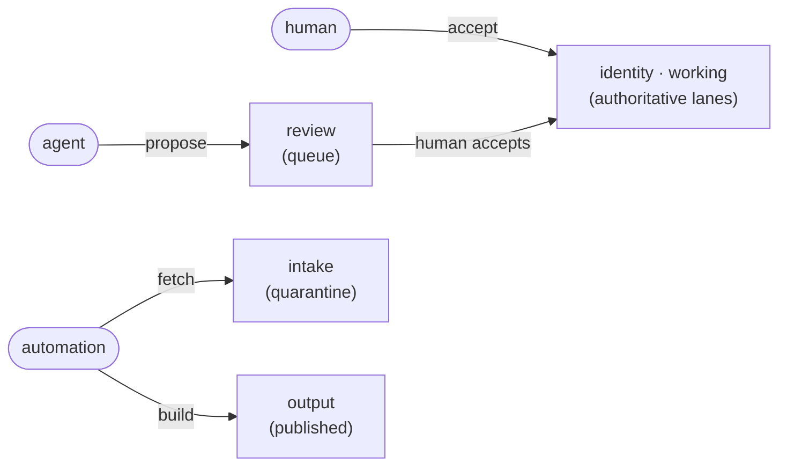

<p align="center">
  <picture>
    <source media="(prefers-color-scheme: dark)" srcset="docs/assets/branding/wordmark-dark.png">
    
  </picture>
</p>

<p align="center">
  <a href="https://github.com/patrick204nqh/textus/actions/workflows/ci.yml"></a>
  <a href="https://rubygems.org/gems/textus"></a>
  <a href="https://www.ruby-lang.org/"></a>
  <a href="LICENSE"></a>
</p>

**A coordination space for humans, AI, and automation.** Your agent forgets between sessions; your notes and `CLAUDE.md` get edited by whoever ran last; nobody can reconstruct who wrote what. textus is durable, multi-writer memory that stays current and survives the model, the session, and the vendor — you keep your space, agents keep theirs, automation keeps external data fresh, and every change crosses a review queue and an audit log.

*textus* is Latin for "the fabric a text is woven from" — same root as *context*, from *con-texere*, "to weave together."

## The idea

Three actors write to your repo today:

- **Humans** — you, your team. Authoritative on identity, decisions, voice.
- **Agents** — Claude, Cursor, custom assistants. Smart, fast, forgetful, and not always right.
- **Automation** — cron jobs, fetchers, CI. Bring outside data in and compile published artifacts.



*Each actor writes only into its own lane; low-trust input climbs to authoritative lanes only by passing a guarded transition (an agent's proposal needs a human `accept`).*

Without coordination, they overwrite each other and nothing remembers why. textus gives each actor a **lane** — called a **zone** in the manifest and CLI, the term used everywhere technical from here on — routes everything they can't write directly through a **review queue**, and writes every successful change to an **append-only audit log**. The lanes are enforced at the protocol level, not by convention.

```
identity/   accept only         — who you are, what you decide, how you sound
working/    accept only         — day-to-day catalog (agents propose via review/, automation feeds via intake/)
intake/     fetch only          — declared external inputs
review/     propose (agent + human) — proposals waiting on a human accept
output/     build only          — computed, published artifacts
```

An agent that tries to write directly into `working/` or `identity/` gets `write_forbidden`. It writes to `review/` instead. You accept the good proposals; textus promotes them, records the move, and audits both halves. Stable per-entry `uid:` means a reorganization doesn't break references. A monotonic audit cursor (`textus pulse --since=N`) means the next session — possibly a different agent, possibly a different model — picks up exactly where the last one left off.

That's the load-bearing claim: **coordination is a protocol invariant, not a library convenience.**

## See it in four commands

```sh
gem install textus
textus init                          # creates .textus/ with zones + schemas
# agent proposes a change to review/
printf '%s' '{"_meta":{"name":"oncall","proposal":{"target_key":"working.notes.oncall","action":"put"}},"body":"Patrick on call.\n"}' \
  | textus put review.notes.oncall --as=agent --stdin
# you accept it — textus promotes to working/ and audits the move
textus accept review.notes.oncall --as=human
```

Try the gate the other way (`textus put working.notes.X --as=agent`) and you get `write_forbidden`, with the role that *would* be allowed named in the error. That refusal is the whole point.

## Try it

- **5-command worked demo** — single terminal scroll, no MCP, no schemas: [`examples/hello/`](examples/hello/)
- **Wire textus into Claude Code via MCP** — 4 steps, ~5 minutes: [`docs/agents-mcp.md`](docs/agents-mcp.md)
- **Use textus as your own project's context store**: [`examples/project/`](examples/project/)
- **Use textus to author a Claude plugin** (textus is the source-of-truth, build publishes to `agents/`, `skills/`, `commands/`): [`examples/claude-plugin/`](examples/claude-plugin/)

## Protocol, not just a gem

This Ruby gem is the reference implementation of **`textus/3`** — a wire format and storage convention any language can speak. The protocol owns the envelope shape, the role/zone gate, the audit log format, and the key grammar. The gem version (semver, see badge) and the protocol version (`textus/3`) move independently; envelopes carry the `protocol` field so consumers can pin to the contract, not the implementation.

- Specification: [`SPEC.md`](SPEC.md)
- Architecture: [`docs/architecture/README.md`](docs/architecture/README.md)
- Per-release notes: [`CHANGELOG.md`](CHANGELOG.md)

A second implementation in another language would share the same `.textus/` directory and the same audit log. That's deliberate.

## Install

```sh
gem install textus
```

Or from this repo:

```sh
bundle install
bundle exec exe/textus --help
```

## What `textus init` gives you

You get `.textus/` with all five zone directories, baseline schemas, an empty audit log, and a starter manifest. Roles declare capabilities; each zone declares a `kind:`, and write authority is derived from the role's capabilities crossed with the zone's kind:

```yaml
roles:
  - { name: human,      can: [author, propose] }
  - { name: agent,      can: [propose] }
  - { name: automation, can: [fetch, build] }

zones:
  - { name: identity, kind: canon }       # accept
  - { name: working,  kind: canon }       # accept
  - { name: intake,   kind: quarantine }  # fetch
  - { name: review,   kind: queue }       # propose
  - { name: output,   kind: derived }     # build
```

```
.textus/
  manifest.yaml       # role capabilities + zone kinds + key-to-path mapping
  audit.log           # append-only NDJSON, every write
  schemas/            # YAML field shapes per entry family
  templates/          # mustache templates for derived entries
  hooks/              # one .rb per hook
  sentinels/          # publish bookkeeping
  zones/
    identity/         # accept — identity, voice, decisions
    working/          # accept — day-to-day catalog
    intake/           # fetch — declared external inputs (actions)
    review/           # propose (agent + human) — proposals awaiting accept
    output/           # build — computed outputs
```

Manifest `path:` fields are relative to `.textus/zones/`. So `working.notes.org.jane` lives at `.textus/zones/working/notes/org/jane.md`.

Read and write:

```sh
textus get working.notes.org.jane
textus list --zone=working
printf '%s' '{"_meta":{"name":"bob","org":"acme"},"body":"hi\n"}' \
  | textus put working.notes.bob --as=human --stdin
textus freshness --zone=output       # per-entry fresh/stale/never_fetched/no_policy
textus rule list                     # show every rule block
textus audit --limit=20              # query the audit log
```

(All verbs return JSON envelopes by default; pass `--output=json` explicitly if you prefer.)

For the full shape — Claude plugin with agents, skills, commands, pending walkthrough, intake action — see [`examples/claude-plugin/`](examples/claude-plugin/).

## What's shipped

- **Per-entry formats & publish.** `format: markdown|json|yaml|text` per entry; `publish_to:`/`publish_each:` byte-copy derived files to their consumer paths. ([SPEC §5.2–5.3](SPEC.md))
- **Stable identity.** Auto-minted `uid:` survives writes and `textus key mv`; reorganising never breaks references.
- **Capability × zone-kind gate.** Writes carry `--as=<role>`; a role may write a zone iff it holds the capability the zone's `kind:` requires (`canon`→`accept`, `quarantine`→`fetch`, `queue`→`propose`, `derived`→`build`). The wrong role gets `write_forbidden` naming the capability needed and the roles that hold it. ([SPEC §5](SPEC.md))
- **Agent loop.** `textus boot` orients a fresh session; `textus pulse --since=N` is the per-turn heartbeat (changed entries, stale keys, pending proposals). ([docs/agents-mcp.md](docs/agents-mcp.md))
- **`textus doctor`.** 15 health checks across schemas, hooks, keys, sentinels, and the audit log.

## CLI and zones

All verbs accept `--output=json` and return the envelope defined in [SPEC §8](SPEC.md). Write verbs require `--as=<role>` (role resolution: `--as` → `TEXTUS_ROLE` env → `.textus/role` file → default `human`). Default roles: `human`, `agent`, `automation` (rename or add your own in the manifest's `roles:` block).

- Full verb table — read, write, health, scaffolding — is in [SPEC §9](SPEC.md).
- Zone semantics and the capability × zone-kind mapping live in [SPEC §5](SPEC.md), with a tutorial expansion in [`docs/zones.md`](docs/zones.md).

`textus boot` prints the same information for the current store: zones, entry families with schemas, registered hooks, write flows, and the verb catalog. Run it inside a store and you get the live picture; reach for the SPEC when you want the contract.

## Compute and publish

Derived entries declare `compute: { kind: projection, select: ..., pluck: ..., sort_by: ..., limit: ..., transform: name }` and either a template under `.textus/templates/` (markdown/text) or a templateless path that lets a transform hook shape the output directly (json/yaml). Projections cap at 1000 rows; the vendored Mustache subset caps at depth 8. No partials, no lambdas, no HTML escaping.

For externally-generated entries, declare `compute: { kind: external, sources: [...] }` — textus tracks the declared sources for staleness; the build automation produces the file.

`publish_to: [path]` byte-copies a single derived file to one target. `publish_each: "template/{basename}.md"` on a nested entry byte-copies every leaf to its templated target — substitutes `{leaf}`, `{basename}`, `{key}`, `{ext}`. Sentinels for every published file live under `.textus/sentinels/`. See SPEC §5.2, §5.3, §5.12.

## Extension points

textus exposes a hook DSL. Drop `.rb` files into `.textus/hooks/` (subdirectories are fine; files load alphabetically by full path). Events:

- `:resolve_intake` — bring bytes in from elsewhere (returns `{_meta:, body:}`)
- `:transform_rows` — transform rows during projection (returns rows)
- `:validate` — custom doctor check (returns issues)
- `:entry_put`, `:entry_deleted`, `:entry_fetched`, `:build_completed`, `:proposal_accepted`, `:file_published`, `:entry_renamed`, `:proposal_rejected`, `:store_loaded` — react to lifecycle events
- `:fetch_started`, `:fetch_failed`, `:fetch_backgrounded` — background-fetch lifecycle

```ruby
# Inside .textus/hooks/local_file.rb
Textus.hook do |reg|
  reg.on(:resolve_intake, :local_file) do |config:, args:, **|
    path = config["path"] or raise "local-file requires intake.config.path"
    {
      _meta: { "last_fetched_at" => Time.now.utc.iso8601, "source_path" => path },
      body: File.read(File.expand_path(path)),
    }
  end
end
```

```ruby
Textus.hook do |reg|
  reg.on(:transform_rows, :rank_by_recency) do |rows:, **|
    rows.sort_by { |r| r["updated_at"].to_s }.reverse
  end
end
```

To keep a batch of stale intake entries current in one shot:

```sh
textus fetch stale --prefix=working --zone=intake --as=automation
# or just fetch everything stale in the intake zone:
textus fetch stale --zone=intake --as=automation
```

See SPEC.md §5.10 for the full hook contract.

Schemas (`.textus/schemas/<name>.yaml`) declare field shapes, per-field `maintained_by:` ownership, and an `evolution:` block (`added_in`, `deprecated_at`, `migrate_from`). Full contract in SPEC §5.8.

See [`docs/agents-mcp.md`](docs/agents-mcp.md) for the agent boot → pulse loop.

## Examples

[`examples/claude-plugin/`](examples/claude-plugin/) — a Claude Code plugin (`voice-tools`) whose entire content surface — agents, skills, commands, `CLAUDE.md`, `plugin.json`, `marketplace.json` — is textus-managed. Demonstrates per-entry formats, `publish_each`, intake actions, in-process transforms and hooks, the agent-propose / human-accept loop, and the `inject_boot:` flag that puts an orientation preamble at the top of `CLAUDE.md`.

## Tests

```sh
bundle exec rspec
```

~920 examples; includes conformance fixtures A–I from SPEC §12.

## Code quality

```sh
bundle exec rubocop      # lint
bundle exec rubocop -A   # lint + autocorrect
```

Lefthook hooks (`brew bundle install` then `lefthook install`) run rubocop on `pre-commit` and `rspec + rubocop` on `pre-push`. Bypass with `LEFTHOOK=0 git commit ...` when needed. CI runs `rspec` (Ruby 3.3 / 3.4) and `rubocop` via GitHub Actions.

## License

MIT.
