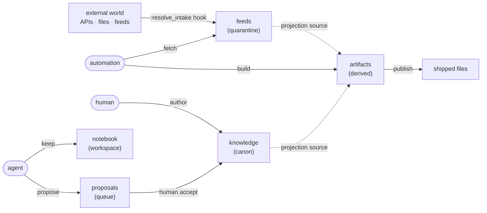

## 1. The mental model

A textus store is a small **data-flow graph**. Information enters from outside, gets curated by humans and AI, and gets compiled into files you ship.

*Flow at a glance:* automation pulls external bytes into `feeds` (the `fetch` capability); humans write `knowledge` directly (the `author` capability); agents maintain their own `notebook` (the `keep` capability) and `propose` into `proposals`; a human `accept` promotes proposals to `knowledge`; automation `build`s `artifacts` from `knowledge`/`feeds` and publishes shipped files.

Two ideas do all the work:

- **A zone is a write-authority partition.** Each zone declares its `kind:`; the kind decides which capability a writer must hold. Directory names are convention; the manifest is the source of truth.
- **A role is a bundle of capabilities.** A role holds verbs from a closed five-element set — `propose`, `author`, `keep`, `fetch`, `build` — and may write a zone iff it holds the verb that zone's kind requires. Every `textus put` carries `--as=<role>`, and the writer is refused if that role lacks the required capability.

Everything else — projections, publishing, hooks, schemas — is layered on top of those two ideas.
