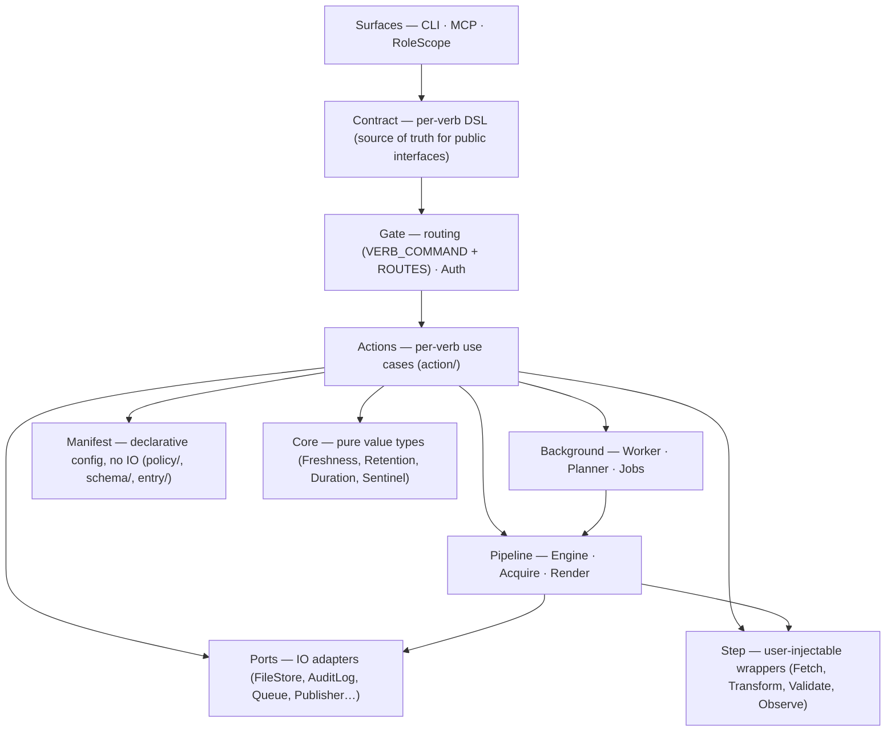

# Textus architecture

> **Explanation** · for contributors · **read this first** for orientation before SPEC
> **SSoT for** the Ruby implementation layout (layers, container, ports, dispatch/pipeline paths) · **reviewed** 2026-06 (v0.53)



*Dependency rule: inward only.* `surfaces/` → `contract/` → `gate/` → `action/` → inner layers. Actions never reference surfaces. The old `dispatch/` namespace was dissolved by ADR 0114; its concerns now live across `gate/`, `action/`, and `background/`.

### What lives in each layer

**Surfaces**

```
surfaces/cli/     CLI command generation from contracts
surfaces/mcp/     MCP server — stdio JSON-RPC 2.0, tools derived from contracts
surfaces/role_scope.rb
                  (Store#as(role)) — holds (container, role, dry_run, correlation_id);
                  all verb methods injected here via define_method in textus.rb
```

**Contract**

```
contract/         Per-verb DSL — verb, summary, surfaces, arg, view.
                  Contract::Binder.inputs_from_ordered splits the uniform inputs hash
                  into positional/keyword args for every surface.
                  Contract::DSL is extended by each Action class.
```

**Gate + Auth**

```
gate.rb           VERB_COMMAND  (verb symbol → Command class)
                  ROUTES        (Command class → [Action class])
                  Gate#dispatch(cmd) — Auth → action

gate/auth.rb      Gate::Auth — command-based check!(cmd) + inline check_action!
                  FLOOR predicates: lane_writable_by, author_held
                  Rule predicates: guard: block in manifest rules
```

**Actions**

```
action/{get,list,put,key_delete,key_mv,accept,reject,propose,
        drain,enqueue,audit,blame,deps,rdeps,published,boot,doctor,
        rule_explain,rule_list,rule_lint,pulse,
        data_mv,key_mv_prefix,key_delete_prefix,
        schema_envelope,where,uid,jobs}.rb
action/write_verb.rb  (base for all write actions — run_with_cascade)
```

**Background (async)**

```
background/worker.rb          drain loop — leases and runs jobs from Ports::Queue
background/job/{materialize,refresh,sweep}.rb
                              typed job classes; registered in Background::Job.registry
background/planner/plan.rb    Plan.seed — seeds refresh+sweep jobs from manifest rules
background/retention/apply.rb retention policy enforcer
```

**Pipeline**

```
pipeline/engine.rb            Engine.converge(container:, call:, keys:)
pipeline/acquire/intake.rb    Acquire::Intake — fetch handler, persist, publish events
pipeline/acquire/handler.rb   step invocation under timeout
pipeline/acquire/projection.rb  from: derive entries
pipeline/acquire/serializer/  Json/Yaml/Text serialize before persisting
pipeline/render.rb            Mustache template expand → Ports::Publisher
```

**Core (pure value types)**

```
core/freshness/{verdict,evaluator}.rb
core/retention/          retention policy value objects
core/duration.rb  core/sentinel.rb
```

**Infrastructure**

```
store.rb           Composition root — builds Container, wires ports, injects verb methods
container.rb       Data.define(:manifest, :file_store, :schemas, :root,
                               :audit_log, :steps, :gate)
manifest.rb        Manifest.load — assembles four carved sub-objects
schemas.rb         Eager-load cache
ports/{audit_log,clock,publisher,build_lock,queue/,sentinel_store,watcher_lock,storage/}.rb
step/{event_bus,registry_store,loader,context,fire_report,
      signature,builtin,error_log,fetch,transform,validate,observe}.rb
entry/{markdown,json,yaml,text}.rb  (format strategies)
envelope/io/{reader,writer}.rb
doctor/check/      schema + role-authority validation
```

## How a verb becomes a method

Action classes live under `lib/textus/action/`. Each class extends `Contract::DSL` and declares its own contract inline:

```ruby
module Textus
  module Action
    class Get < Base
      extend Textus::Contract::DSL

      verb :get
      summary "Read one entry …"
      surfaces :cli, :mcp
      arg :key, String, required: true, positional: true, description: "…"
      view { |v, _i| v.to_h_for_wire }

      BURN = :sync

      def initialize(key:) = super()

      def call(container:, call:) = …
    end
  end
end
```

Three tables wire a verb symbol to its runtime path. All three are defined in `textus.rb` (after Zeitwerk eager-load):

| Table | Location | Maps |
|---|---|---|
| `Textus::Action::VERBS` | `textus.rb` | verb symbol → Action class |
| `Gate::VERB_COMMAND` | `gate.rb` | verb symbol → Command class |
| `Gate::ROUTES` | `gate.rb` | Command class → [Action class] |

Adding a new verb requires: a `Command::*` `Data.define` struct, an Action class with `Contract::DSL`, and one entry in each of the three tables.

`textus.rb` uses `define_method` to inject verb methods onto both `Store` and `Surfaces::RoleScope`. The RoleScope method:

1. Builds inputs from args/kwargs via `Contract::Binder.inputs_from_ordered`.
2. Constructs `cmd = Gate::VERB_COMMAND[verb].new(**inputs)`.
3. Calls `@container.gate.dispatch(cmd, correlation_id: @correlation_id)`.

`Gate#dispatch` then:

1. Normalises propose-key if needed.
2. Calls `Gate::Auth.new(@container).check!(cmd)` — raises `WriteForbidden` / `GuardFailed` on failure.
3. Builds a `Call` (role, dry_run, correlation_id).
4. Looks up `ROUTES[cmd.class]` → action class list; instantiates and calls each.

`Envelope::IO::{Reader,Writer}` live outside Gate because they are composed by actions, not dispatched as verbs.

## Container

Use cases never see the raw `Store`. `Textus::Container` is a single record holding wired collaborators:

```ruby
Container = Data.define(
  :manifest, :file_store, :schemas, :root,
  :audit_log, :steps, :gate
)
```

`Store` builds one `Container` at boot; every action receives it via `(container:, call:)`. Step handlers receive `caps: <Container>` — they access `caps.manifest`, `caps.steps`, etc.

## Ports

Ports are infrastructure adapters with an interface defined by the domain. Each port is independently replaceable — swap the implementation for tests or alternative runtimes without touching application or domain code.

| Class | Role |
|---|---|
| `Ports::Storage::FileStore` | Bytes-only FS I/O — `read`, `write`, `delete`, `exists?`, `etag`. No knowledge of envelopes or schemas. |
| `Ports::AuditLog` | Append-only structured log (`audit.log`). Owns seq numbering, file-locking, and rotation. |
| `Ports::Clock` | Supplies `Time.now` — a module-function so tests can swap it without dependency injection boilerplate. |
| `Ports::Publisher` | Copies a built artifact to a repo-relative consumer path and writes a sentinel so the next publish can confirm the target is managed. |
| `Ports::BuildLock` | Process-exclusive `flock` guard over the produce pipeline. Raises `BuildInProgress` if a build is already running. |
| `Ports::Queue` | Persistent job queue used by `drain`/`serve` workers; tracks ready/leased/done/failed jobs and powers async background jobs (`materialize`, `refresh`, `sweep`). |
| `Ports::SentinelStore` | Reads and writes the per-target sentinel file that `Publisher` uses to detect unmanaged overwrites. |
| `Ports::WatcherLock` | Single-watcher `flock` guard used by `Surfaces::Watcher` to ensure only one watcher loop is active per store root. |

Application use cases access ports only through `Container` fields — never through the raw `Store`.

### EnvelopeIO

`Envelope::IO::Reader` and `Envelope::IO::Writer` split the envelope pipeline into read-only parse and write-with-audit halves.

**Reader** (`lib/textus/envelope/io/reader.rb`) — resolves a key through `manifest.resolver`, reads bytes via `FileStore`, delegates parsing to the format strategy (`Entry.for_format`), and returns an `Envelope`. No audit, no events, no permission checks. Also used by `Writer` for the existing-uid lookup on `put`.

**Writer** (`lib/textus/envelope/io/writer.rb`) — owns the full write pipeline: serialize → schema-validate → etag-check → `FileStore#write` → `AuditLog#append`. The class comment states the invariant directly: every public method's final action is `@audit_log.append(...)`. If the audit append fails, the caller sees the underlying error — the byte write already happened, but the pipeline contract treats audit as the commit step. No permission check, no event firing — those stay in the calling action (`Action::Put`, `Action::KeyDelete`, `Action::KeyMv`).

The three public methods are `put`, `delete`, and `move`; all follow the same validate → write → audit sequence.

Both are built from a `Container` via named constructors — `Writer.from(container:, call:)` (which builds its own `Reader.from`) and `Reader.from(container:)` (ADR 0026). Write actions call `Writer.from` rather than reconstructing the object graph by hand, so a change to the Writer's dependencies is a one-line edit in one place.

## Manifest carving

Manifest carving means slicing the parsed manifest YAML into four purpose-specific sub-objects. Each consumer sees only the fields it needs; none reach into the full raw document.

`Manifest` itself is a `Data.define` struct — a composition record with four named members:

| Member | Class | Responsibility |
|---|---|---|
| `data` | `Manifest::Data` | Frozen value: `raw`, `root`, `lanes`, `entries`, `audit_config`, `role_caps` (role name → capability set). Structural data only — no behaviour beyond accessors and key validation. |
| `resolver` | `Manifest::Resolver` | Key → `Resolution(entry, path, remaining)`. Handles nested entry enumeration and fuzzy-match suggestions. |
| `policy` | `Manifest::Policy` | Lane/capability authority — `verb_for_lane` (lane-kind → required capability), `roles_with_capability(cap)`, `lane_writers` (derived: roles holding the capability the lane's kind requires), `declared_kind`, `proposer_role`, `propose_lane_for(role)`. Write authority is derived from capabilities × lane-kind (ADR 0030); no filesystem I/O. `propose_lane_for` returns the single `kind: queue` lane when the role can write it. |
| `rules` | `Manifest::Rules` | Pattern-matched rule engine. `rules.for(key)` returns a `RuleSet(fetch, handler_permit, guard, retention)` by evaluating all `match:` blocks against the key. |

Rationale: cleaner test seams — a use case that only needs key resolution constructs a `Manifest::Resolver` from a stub `Data`; one that only needs rule lookup constructs a `Manifest::Rules` directly. No consumer is forced to build the full manifest to exercise one sub-view.

The four members are wired in `Manifest.build` (`lib/textus/manifest.rb`). `Manifest::Data` constructs `Policy` internally during `initialize`; the others are assembled by the loader and handed in as named arguments.

## Read path (`store.get(key)`)

`Action::Get` is the single public read verb. It is a **pure read** (ADR 0089): it resolves the path, reads bytes, parses the envelope, and annotates a freshness verdict — it NEVER ingests and NEVER mutates. Machine-lane freshness is system-pushed via `drain` (scheduled sweep) and `hook run` (event push).

1. CLI verb (or MCP tool) calls `store.as(role).get(key)`.
2. The injected `RoleScope#get` builds `Command::Get.new(key:, role:)` and calls `gate.dispatch(cmd)`.
3. `Gate#dispatch` calls `Gate::Auth#check!(cmd)`, which passes immediately — `:get` has no FLOOR predicates and typically no rule guards. Then calls `Action::Get#call(container:, call:)`.
4. `Action::Get#call(key)` resolves the path through `container.manifest`, reads bytes via `container.file_store`, parses the envelope, and annotates a freshness verdict. When the key has no lifecycle rule, the envelope is annotated fresh. A stale entry is returned **stale** — the read does not refresh it; the next `drain` does.

Because the read is always pure, every caller — interactive reads, dashboards, and in-process callers (accept/reject/publish, materializer, uid, schema/tools, hooks) — gets the same orchestrator-free, side-effect-free read.

## Write path (`store.put(key, ...)`)

1. CLI/MCP surface calls `store.as(role).put(key, meta:, body:, content:, if_etag:)`.
2. The injected `RoleScope#put` builds `Command::Put.new(...)` and calls `gate.dispatch(cmd)`.
3. `Gate#dispatch` calls `Gate::Auth#check!(cmd)`: evaluates FLOOR predicate `lane_writable_by` plus any rule-declared guards — raises `WriteForbidden` / `GuardFailed` on failure.
4. `Action::Put#call` validates the key, resolves the manifest entry, calls `Gate::Auth#check_action!` inline for etag/schema guards, then delegates persistence to `Envelope::IO::Writer#put` (serialize → schema-validate → etag-check → `FileStore#write` → `AuditLog#append`).
5. Publishes `:entry_written` via `container.steps`.
6. `WriteVerb#run_with_cascade` enqueues `Background::Job::Materialize` for each rdep of the written key.

`Action::{KeyDelete,KeyMv,Accept,Reject,Propose}` follow the same shape, all inheriting `WriteVerb#run_with_cascade`.

## Pipeline path (`drain` + reactive `entry_written`)

The pipeline handles two concerns — **acquire** (pull live data via an intake handler or derive from sources) and **render** (template-driven artifact publish) — unified under `Pipeline::Engine`.

`Pipeline::Engine.converge(container:, call:, keys:)` is the entry point that `Background::Job::Materialize` calls. Both the batch path (`drain` seeds jobs via `Background::Planner::Plan.seed`) and the reactive path (write actions enqueue `materialize` jobs via `WriteVerb#run_with_cascade`) flow through `Background::Worker` into `converge`.

For each key, `Engine#produce_one`:

1. **Acquire phase** — `Pipeline::Acquire::Intake#run(key)`:
   - Resolves the manifest entry; looks up the step handler via `container.steps`.
   - Publishes `:entry_fetch_started` via `container.steps`.
   - Invokes the `Step::Fetch` handler under a timeout deadline (`Pipeline::Acquire::Handler`).
   - On error: publishes `:entry_fetch_failed`, re-raises.
   - On success: normalises the handler result, checks auth (`Gate::Auth#check_action!` with `:converge`), persists via `Envelope::IO::Writer`, publishes `:entry_fetched` unless etag is unchanged.
   - The sibling **projection** sub-path — `from: derive` entries — runs `Acquire::Projection`, which renders data files through `Acquire::Serializer::{Json,Yaml,Text}` before persisting.
2. **Render phase** — calls `Pipeline::Render#bytes_for(target:, data:, boot:)` to expand the Mustache template and copy the result to the publish target via `Ports::Publisher`. Returns `nil` if no publish is configured (skipped).

Per-entry failures are published as `:produce_failed` by `Background::Job::Materialize` after `Engine.converge` returns. A held `BuildLock` is a soft miss — the in-flight build already produces fresh output.

`Background::Worker` drives the queue loop. It leases jobs, looks up the job class via `Background::Job.fetch(job.type)`, instantiates it, and calls `action.call(container:, call:)`. Three job types: `materialize` (acquire + render), `refresh` (intake-only re-fetch), `sweep` (retention pruning seeded by `Background::Planner`).

## Hook payload contract

Pub-sub hooks (`:entry_written`, `:entry_fetched`, …) receive `ctx:` — a `Textus::Step::Context` that exposes a narrow surface (`get`, `list`, `put`, `delete`, `audit`, `publish_followup`, plus `role` and `correlation_id`). The raw `Store` is not handed out.

RPC hooks (`:resolve_handler`, `:transform_rows`, `:validate`) receive `caps:` — a `Textus::Container`. They are gem-internal: the framework calls them, not user pub-sub.

## Agent surface (boot + pulse + MCP)

Agents and plugins talk to a textus store through three layers:

```
soul (skill/agent)  ──▶  gate (CLI | MCP)  ──▶  Store  ──▶  memory (.textus/)
```

Two transports, one façade:

- **CLI** — human/script surface. `textus boot`, `textus pulse --since=N`, `textus get/put/...`.
- **MCP** — agent surface. `textus mcp serve` runs a stdio JSON-RPC 2.0 server speaking MCP draft 2024-11-05. Tools are auto-derived from the manifest. Session state (cursor, role, contract_etag) is server-side.

Both transports call `store.as(role).<verb>(...)`. No duplicate logic.

The agent loop (cadence guide in [`agents-mcp.md`](../how-to/agents-mcp.md)):

1. **Session start:** `boot()` → contract envelope (lanes, entries, schemas, write_flows, agent_quickstart with `latest_seq`).
2. **Per turn:** `pulse(since=cursor)` → `{cursor, changed, stale, pending_review, doctor}`.
3. **On demand:** `get`, `put`, `propose`, `schema_show`, `rule_explain`.

Contract drift surfaces as `ContractDrift` (contract_etag mismatch — a change to the manifest, hooks, or schemas; ADR 0074); audit cursor falls off the keep window as `CursorExpired`. Both signal "call `boot` again."

Role assertions are **asserted identities**, not authenticated credentials (ADR 0115): Gate enforces capability constraints, not identity. This model is correct for local single-machine deployments; network-accessible transports require credential binding outside this scope.

## Hooks event catalog

`Step::Signature` is the single home of callable keyword-introspection — both `Step::EventBus` (pub-sub dispatch) and the RPC registry delegate to it for `accepts_keyrest?`, `declared_keys`, `missing`, and `filter`. RPC handlers declare `caps:` (single handler); pub-sub handlers declare `ctx:` (0..N handlers).

The event names, payloads, and per-verb firing order are documented once in [`reference/events.md`](../reference/events.md) (the friendly SSoT); the authoritative source is `lib/textus/step/catalog.rb` (`Catalog::RPC` and `Catalog::PUBSUB`) and `lib/textus/events.rb` (dotted event name constants).
