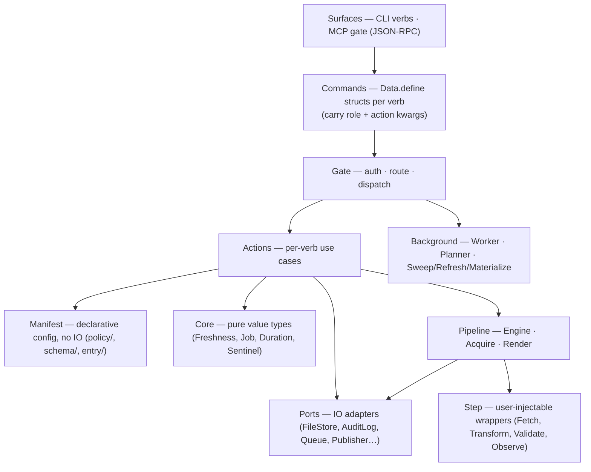

# Textus architecture

> **Explanation** · for contributors · **read this first** for orientation before SPEC
> **SSoT for** the Ruby implementation layout (layers, container, ports, dispatch/pipeline paths) · **reviewed** 2026-06 (v0.47)



*Dependency rule: inward only. Surfaces build Commands and call `store.gate.dispatch(cmd)`. Gate looks up the route (Command class → Action classes), runs `Gate::Auth#check!`, and calls each Action in sequence. Actions own domain logic and port access. Background (Worker, Planner) and Pipeline are private — never referenced from surfaces or contracts.*

### What lives in each layer

**Interface**

```
CLI verbs:  store.gate.dispatch(cmd, container:)
            store.as(role).<verb>(...)    # backward-compat (delegates to Gate)

MCP gate:   textus mcp serve — same actions, JSON-RPC.
```

The CLI is a **projection of the per-verb `Contract`** (ADR 0063), the operator
mirror of `MCP::Catalog`. The contract owns the whole request lifecycle —
`acquire → bind → invoke → render` (ADRs 0066–0068): one `Contract::Binder.bind`
splits the uniform by-name `inputs` hash into the Command's member kwargs;
per-surface `view`s shape the output (`view` for MCP/Ruby, `view(:cli)` for the
operator envelope); declarative `source:`/`coerce:`/`cli_stdin` populate inputs
from files and stdin; `around:` resources wrap the dispatch for stateful verbs
(e.g. cursor injection for pulse); and `cli_default:` declares a CLI default
diverging from the agent default. `CLI::Runner` generates a command per `:cli`
contract, building the Command and calling `store.gate.dispatch` by construction.
Only verbs with genuine *behavior* — `put` (entry persistence), `get`
(UnknownKey + resolver suggestions, CLI-only), and `doctor` (not yet generatable)
— stay hand-authored, plus commands with no dispatcher verb (`init`, `hook`,
`mcp serve`, `schema diff/init`). `boot` is auto-generated from its contract.

**Surfaces**

```
CLI verbs:  surface → build Command → gate.dispatch
MCP gate:   surface → build Command → gate.dispatch (via Catalog.call)
```

Every surface follows the same pattern: parse the transport-specific args into
a uniform `inputs` hash, look up the `Command` class via `Gate::VERB_COMMAND`,
initialize the Command with inputs + role, and call `store.gate.dispatch(cmd)`.
No surface dispatches directly to an Action class — all routing goes through
Gate.

**Gate (single dispatch entry point)**

```
Gate             (looks up route: Command class → [Action, ...])
  ├─ Auth        (FLOOR predicates + rule guards — raises WriteForbidden/GuardFailed)
  └─ dispatch    (creates Action from Command kwargs, calls action.call)
```

Every Command has a `role` member. Gate::Auth checks the command's role against
the FLOOR predicates for the verb and any rule-declared guards. On success, Gate
extracts kwargs from the Command (minus role, unless the action accepts it) and
calls each Action in the route. Single-route commands return the action's result
directly; multi-route commands return an array of results.

**Actions (per-verb domain logic)**

```
action/{get,list,put,key_delete,key_mv,accept,reject,propose,
        drain,enqueue,audit,blame,deps,rdeps,published,boot,doctor,
        rule_explain,rule_list,rule_lint,pulse,
        data_mv,key_mv_prefix,key_delete_prefix,
        schema_envelope,where,uid,jobs}.rb

action/background/{materialize,refresh,sweep}.rb   (Worker-only — no Command, no Gate)
```

Actions are plain classes receiving `(container:, call:)`. Public verbs have a
Command struct and a `Gate::ROUTES` entry. Background actions (`Materialize`,
`Refresh`, `Sweep`) are Worker-only — they declare a `TYPE` constant for job
queue lookup, have no contract DSL, and are never surfaced on CLI/MCP.

**Background (async job infrastructure)**

```
background/{worker,plan}.rb
background/planner/{planner,scheduler,seeder}.rb
background/retention/apply.rb
```

The Worker leases jobs from `Ports::Queue`, looks up the action class via
`Action.fetch(type)` (which resolves `TYPE` constants), and calls
`action.call(container:, call:)`. The Planner generates job sets from trigger
events (`manual.kick`, `schedule.tick`, `entry.written`) for the Seeder/Worker
to process.

**Pipeline (derivation + acquisition)**

```
pipeline/{engine,render}.rb
pipeline/acquire/{intake,handler,projection,serializer}.rb
```

`Pipeline::Engine.converge` is the entry point for materializing derived and
intake entries. Called by `Action::Background::Materialize` (Worker path) and
by `WriteVerb#cascade_to_rdeps` (reactive path). Two phases per key:
1. **Acquire** — `Acquire::Intake` resolves the entry, invokes the step handler,
   and persists via `Envelope::IO::Writer`.
2. **Render** — publishes the entry through its `publish:` block via
   `Ports::Publisher` (byte-copy) or `Pipeline::Render` (template expansion).

**Core (pure value types)**

```
Freshness::{Verdict,Evaluator}
Jobs::Job          (immutable job value object)
Duration  Sentinel
```

**Infrastructure**

```
Store              (composition root — wires ports,
                    vends a Container + exposes gate)
Storage::FileStore (bytes-only port: read/write/delete/exists?/etag)
Manifest           (Data, Resolver, Policy, Rules)
Schemas            (eager-load cache)
Ports::{AuditLog,AuditSubscriber,Publisher,Clock,
        BuildLock,Queue,SentinelStore,WatcherLock}
Step::{EventBus,RegistryStore,Loader,Context,FireReport,
       Signature,Builtin,ErrorLog,Fetch,Transform,Validate,Observe}
Entry::{Markdown,Json,Yaml,Text}  (format strategies)
Doctor::Validator  (schema + role-authority validation — called by doctor check)
```

## How a verb becomes a Command

Every public verb has a `Command` struct under `lib/textus/command.rb`:

```ruby
module Textus
  module Command
    Get   = Data.define(:key, :role)
    Put   = Data.define(:key, :meta, :body, :content, :if_etag, :role)
    ...
  end
end
```

Commands are typed `Data.define` structs with one member per action kwarg plus
`:role`. The role is always the last member — surfaces inject it from the
resolved connection/CLI role.

Gate maps Command classes to Action classes in `Gate::ROUTES`:

```ruby
ROUTES = {
  Command::Get => [Textus::Action::Get],
  Command::Put => [Textus::Action::Put],
  ...
}.freeze
```

Adding a new verb is **one Command struct + one Action class + one ROUTES entry**
— no metaprogramming, no registry declaration.

## Container

Actions never see the raw `Store`. `Textus::Container` is a single record
holding the wired collaborators:

```ruby
Container = Data.define(
  :manifest, :file_store, :schemas, :root,
  :audit_log, :steps, :gate
)
```

The `Store` builds one `Container` at boot; Gate is built after the container
(since it needs the container) and attached via `Data#define#with`. Every action
receives the container via `(container:, call:)`. Step handlers (Fetch,
Transform, Observe) receive `caps: <Container>` — they access `caps.manifest`,
`caps.steps`, etc.

## Ports

Ports are infrastructure adapters with an interface defined by the domain.
Each port is independently replaceable — swap the implementation for tests or
alternative runtimes without touching application or domain code.

| Class | Role |
|---|---|
| `Ports::Storage::FileStore` | Bytes-only FS I/O — `read`, `write`, `delete`, `exists?`, `etag`. No knowledge of envelopes or schemas. |
| `Ports::AuditLog` | Append-only structured log (`audit.log`). Owns seq numbering, file-locking, and rotation. |
| `Ports::Clock` | Supplies `Time.now` — a module-function so tests can swap it without DI boilerplate. |
| `Ports::Publisher` | Copies a built artifact to a repo-relative consumer path and writes a sentinel so the next publish confirms the target is managed. |
| `Ports::BuildLock` | Process-exclusive `flock` guard over the produce pipeline. Raises `BuildInProgress` if a build is already running. |
| `Ports::Queue` | Persistent job queue used by `drain`/Watcher workers; tracks ready/leased/done/failed jobs. |
| `Ports::SentinelStore` | Reads and writes the per-target sentinel file that `Publisher` uses to detect unmanaged overwrites. |
| `Ports::WatcherLock` | Single-watcher `flock` guard used by `Surfaces::Watcher` to ensure only one watcher loop is active per store root. |

Actions access ports only through `Container` fields — never through the raw
`Store`.

### EnvelopeIO

`Envelope::IO::Reader` and `Envelope::IO::Writer` split the envelope pipeline
into read-only parse and write-with-audit halves.

**Reader** (`lib/textus/envelope/io/reader.rb`) — resolves a key through
`manifest.resolver`, reads bytes via `FileStore`, delegates parsing to the
format strategy (`Entry.for_format`), and returns an `Envelope`. No audit,
no events, no permission checks. Also used by `Writer` for the existing-uid
lookup on `put`.

**Writer** (`lib/textus/envelope/io/writer.rb`) — owns the full write pipeline:
serialize → schema-validate → etag-check → `FileStore#write` → `AuditLog#append`.
The class comment states the invariant directly: every public method's final
action is `@audit_log.append(...)`. If the audit append fails, the caller sees
the underlying error — the byte write already happened, but the pipeline
contract treats audit as the commit step. No permission check, no event firing
— those stay in the calling Action.

Both are built from a `Container` via named constructors — `Writer.from(container:, call:)`
(which builds its own `Reader.from`) and `Reader.from(container:)` (ADR 0026).

## Manifest carving

Manifest carving means slicing the parsed manifest YAML into four
purpose-specific sub-objects. Each consumer sees only the fields it needs;
none reaches into the full raw document.

`Manifest` itself is a `Data.define` struct:

| Member | Class | Responsibility |
|---|---|---|
| `data` | `Manifest::Data` | Frozen value: `raw`, `root`, `zones`, `entries`, `audit_config`, `role_caps`. Structural data only — no behaviour beyond accessors and key validation. |
| `resolver` | `Manifest::Resolver` | Key → `Resolution(entry, path, remaining)`. Handles nested entry enumeration and fuzzy-match suggestions. |
| `policy` | `Manifest::Policy` | Zone/capability authority — `verb_for_zone`, `roles_with_capability(verb)`, `propose_zone_for(role)`. Write authority derived from capabilities × zone-kind (ADR 0030). |
| `rules` | `Manifest::Rules` | Pattern-matched rule engine. `rules.for(key)` returns a `RuleSet(fetch, handler_allowlist, guard, retention)` by evaluating all `match:` blocks. |

## Read path

`Read::Get` is the single public read verb. It is a **pure read** (ADR 0089):
it resolves the path, reads bytes, parses the envelope, and annotates a
freshness verdict — it NEVER ingests and NEVER mutates.

1. Surface (CLI/MCP) builds `Command::Get.new(key:, role:)` and calls
   `store.gate.dispatch(cmd)`.
2. `Gate::Auth` checks the command — `Get` has no FLOOR predicates, so auth
   passes. `Gate#dispatch` looks up `Command::Get → [Action::Get]`.
3. `Action::Get#call` resolves the path through `container.manifest`, reads
   bytes via `container.file_store`, parses the envelope, and annotates a
   freshness verdict (`stale`, `reason`, `fetching: false`).

Because the read is always pure, every caller — interactive reads, dashboards,
and direct in-process callers (accept/reject, uid, schema/tools, hooks/context)
— gets the same side-effect-free read.

## Write path

1. Surface (CLI/MCP) builds a Command (e.g. `Command::Put.new(key:, meta:,
   body:, role:)`) and calls `store.gate.dispatch(cmd)`.
2. `Gate::Auth#check!` evaluates FLOOR predicates (`lane_writable_by`) plus any
   rule-declared guards — raises `WriteForbidden` / `GuardFailed` on failure.
3. `Gate#dispatch` creates the Action from Command kwargs and calls
   `action.call(container:, call:)`.
4. `Action::Put#call` validates the key, resolves the manifest entry, delegates
   persistence to `Envelope::IO::Writer#put` (serialize → schema-validate →
   etag-check → `FileStore#write` → `AuditLog#append`).
5. Publishes `:entry_written` via `container.steps` and fires the cascade
   (materialize rdeps).

`Action::{KeyDelete, KeyMv, Accept, Reject, Propose}` follow the same shape.
All write actions inherit `WriteVerb#run_with_cascade`, which materializes
rdeps synchronously after the write completes (no more enqueuing through
`Dispatch::Event` — cascade is inline).

## Pipeline path (drain + reactive cascade)

`Pipeline::Engine.converge(container:, call:, keys:)` is the entry point
`Action::Background::Materialize` calls. Both the batch path (`drain` seeds
jobs via `Background::Planner::Seeder`) and the reactive path (write actions
call `Background::Materialize.new(key:).call(...)` directly via
`WriteVerb#cascade_to_rdeps`) flow through `converge`.

For each key, `Engine#produce_one`:

1. **Acquire phase** — `Pipeline::Acquire::Intake#run(key)`:
   - Resolves the manifest entry; looks up the step handler via
     `container.steps`.
   - Publishes `:entry_fetch_started` via `container.steps`.
   - Invokes the `Step::Fetch` handler under a timeout deadline.
   - On success: normalises the handler result, checks auth via `Gate::Auth`,
     persists via `Envelope::IO::Writer`, publishes `:entry_fetched`.
2. **Render phase** — `entry.publish_via(context)` calls
   `Pipeline::Render#bytes_for(target:, data:, boot:)` to expand the Mustache
   template and copy the result to the publish target via `Ports::Publisher`.

## Agent surface (boot + pulse + MCP)

```
soul (skill/agent)  ──▶  gate (CLI | MCP)  ──▶  Store  ──▶  memory (.textus/)
```

Two transports, one façade:

- **CLI** — human/script surface. `textus boot`, `textus pulse --since=N`,
  `textus get/put/...`.
- **MCP** — agent surface. `textus mcp serve` runs a stdio JSON-RPC 2.0 server
  speaking MCP draft 2024-11-05. Tools are auto-derived from the manifest.

Both transports build Commands and call `store.gate.dispatch(cmd)`.
Session state (cursor, role, contract_etag) is managed by the MCP server;
the CLI is stateless per invocation.

## Hooks event catalog

`Hooks::Signature` is the single home of callable keyword-introspection — both
`EventBus` (pub-sub dispatch) and `RpcRegistry` (RPC dispatch) delegate to it.

The event names, payloads, and per-verb firing order are documented once in
[`reference/events.md`](../reference/events.md); the authoritative source is
`lib/textus/step/catalog.rb` (`Catalog::RPC` and `Catalog::PUBSUB`).
