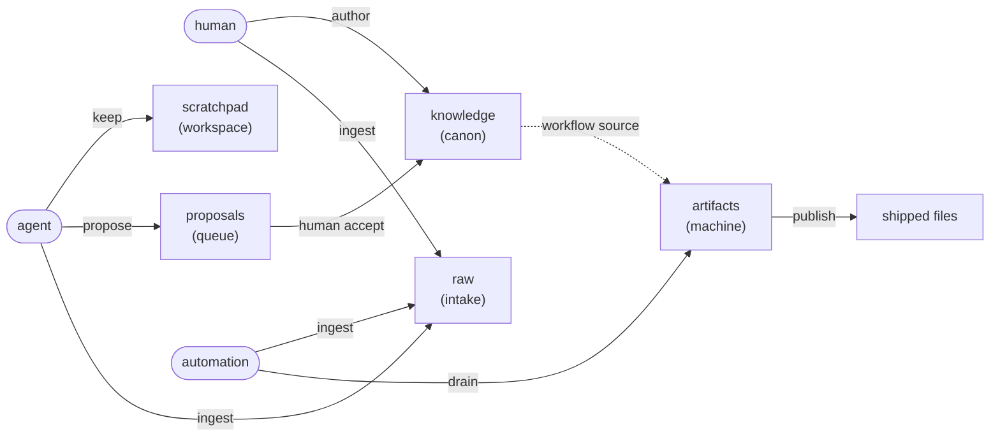

<!-- Generated by textus from the live manifest + static mental model.
     Do not edit by hand — edit .textus/templates/docs/explanation-concepts.erb and run `textus drain`. -->

# Concepts — how textus thinks

> **Explanation** · for everyone · **read when** you want the mental model before the reference

The shape of your context in textus is a small set of ideas that everything else layers on top of: lanes and the roles that write to them, the entries that live in them, how data flows from input adapters out to published files, and how an agent orients to a store and tracks change.

## Table of contents

1. [The lane mental model](#the-lane-mental-model)
2. [The proposal trust path](#the-proposal-trust-path)
3. [Two channels: boot & pulse](#two-channels-boot--pulse)

---

## The lane mental model

A textus store is a small **data-flow graph**. Information enters from outside, gets curated by humans and AI, and gets compiled into files you ship.



Two ideas do all the work:

- **A lane is a write-authority partition.** Each lane declares its `kind:`; the kind decides which capability a writer must hold.
- **A role is a bundle of capabilities.** A role may write a lane iff it holds the verb that lane's kind requires.

### Current lane topology

| Lane | Kind | Capability required | Writers |
|---|---|---|---|
| `knowledge` | `canon` | `author` | `human` |
| `scratchpad` | `workspace` | `keep` | `agent` |
| `proposals` | `queue` | `propose` | `human`, `agent` |
| `artifacts` | `machine` | `converge` | `automation` |
| `raw` | `raw` | `ingest` | `human`, `agent`, `automation` |

### Current role capabilities

| Role | Capabilities |
|---|---|
| `human` | `author`, `propose`, `ingest` |
| `agent` | `propose`, `keep`, `ingest` |
| `automation` | `converge`, `ingest` |

Everything else — workflows, publishing, schemas — is layered on top of those two ideas.

---

## The proposal trust path

The single edge from `proposals` to `knowledge` is where the human-in-the-loop lives. It is the only way bytes reach a `canon` lane without already holding `author` — a two-capability path: an agent can *queue* a change, but only a human can *land* it.

Three ideas make this a *trust* path, not just a copy:

- **Two capabilities, never one.** `propose` lets an agent write into the queue lane. `author` — the single trust anchor — is what `accept` requires.
- **`accept` is a transition, not a capability.** Gated by `author_held` and `target_is_canon`.
- **The proposal carries its own destination.** `target_key` and `action` (`put` or `delete`) live in the queued entry's `meta.proposal`.

---

## Two channels: boot & pulse

| Verb | Cadence | Shape | Answers |
|---|---|---|---|
| `boot` | once per session | static contract | "how do I talk to this store?" |
| `pulse` | per turn / per N sec | delta + cursor | "what changed since I last looked?" |

### Boot — one-shot orientation

```sh
textus boot --output=json
```

Returns the working model of the store: lanes with their kinds and derived write authority, entry families, registered workflows, write flows by role, and the full verb catalog. Run once per session and cache it.

### Pulse — recurring delta

```sh
textus pulse --since=<cursor>
```

Returns `changed`, `pending_review`, `contract_etag`, and an updated `cursor`. Advance the cursor each turn.

**Contract drift:** if `contract_etag` differs from the value at boot, the contract has drifted — call `boot` again. The MCP server raises `ContractDrift` (-32001) automatically.

**Cursor expiry:** if the cursor falls off the audit log rotation window, pulse raises `CursorExpired`. Handle by calling `boot` and resuming from `latest_seq`.

---

## Where to go from here

- [`../reference/lanes.md`](../reference/lanes.md) — exact lane, role, and entry semantics
- [`../how-to/agents-mcp.md`](../how-to/agents-mcp.md) — Claude Code quickstart and the operational agent loop
