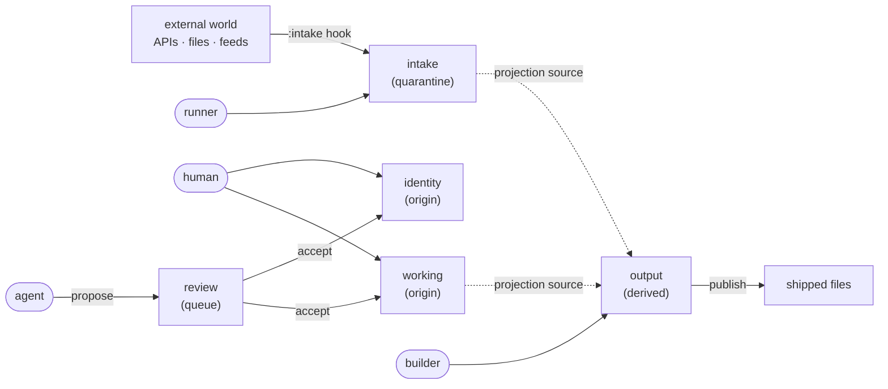

# Zones — shaping your context

> **Reference** · for integrators · **read when** you're designing your zone layout
> **SSoT for** zone semantics, roles, entries, and data flow · **reviewed** 2026-05 (v0.30)

How to define the **shape of your context** in textus: zones, the roles that write to them, the entries that live in them, and how data flows from input adapters out to published files.

This is the user-configuration guide. For the wire protocol, see [`../SPEC.md`](../SPEC.md). For implementation internals, see [`architecture/README.md`](architecture/README.md).

## Table of contents

1. [The mental model](#1-the-mental-model)
2. [Roles — who is allowed to write](#2-roles--who-is-allowed-to-write)
3. [The five default zones](#3-the-five-default-zones) — `identity`, `working`, `intake`, `review`, `output`
4. [Defining your own zones](#4-defining-your-own-zones)
5. [Defining entries](#5-defining-entries)
6. [Wiring data in — intake and `:resolve_intake` hooks](#6-wiring-data-in--intake-and-resolve_intake-hooks)
7. [Wiring data out — derived entries and publishing](#7-wiring-data-out--derived-entries-and-publishing)
8. [Worked example](#8-worked-example)
9. [Enforcement — what `textus doctor` checks](#9-enforcement--what-textus-doctor-checks)

---

## 1. The mental model

A textus store is a small **data-flow graph**. Information enters from outside, gets curated by humans and AI, and gets compiled into files you ship.



*Flow at a glance:* runners pull external bytes into `intake`; humans write `identity`/`working` directly; agents propose into `review` and a human `accept` promotes to `working`/`identity`; the builder computes `output` from `working`/`intake` and publishes shipped files.

Two ideas do all the work:

- **A zone is a write-authority partition.** Each zone declares which roles may write to it. Directory names are convention; the manifest is the source of truth.
- **A role is a write intent.** `human`, `agent`, `runner`, `builder` are the four conventional roles. Every `textus put` carries `--as=<role>`, and the writer is refused if that role isn't listed for the target zone.

Everything else — projections, publishing, hooks, schemas — is layered on top of those two ideas.

---

## 2. Roles — who is allowed to write

Roles are just strings declared in the manifest. The four conventional ones:

| Role | What it represents | Typical verb |
|------|--------------------|--------------|
| `human` | A person editing files directly | `put`, `accept`, `mv` |
| `agent` | An autonomous agent proposing changes | `put` (usually into `review`) |
| `runner` | Automation pulling external data in | `refresh` |
| `builder` | The compiler that materializes derived entries | `build` |

Two analogies that usually click:

- **`runner` is the grocery shopper** — goes outside, brings raw ingredients home.
- **`builder` is the chef** — takes ingredients already in the kitchen and cooks the meal.

You can also invent your own roles (`reviewer`, `import-bot`, `scheduler`) — see [§4](#4-defining-your-own-zones).

---

## 3. The five default zones

`textus init` scaffolds this manifest:

```yaml
zones:
  - { name: identity, kind: origin,     write_policy: [human] }
  - { name: working,  kind: origin,     write_policy: [human, agent, runner] }
  - { name: intake,   kind: quarantine, write_policy: [runner] }
  - { name: review,   kind: queue,      write_policy: [agent, human] }
  - { name: output,   kind: derived,    write_policy: [builder] }
```

| Zone | Purpose | Lifetime | Writers |
|------|---------|----------|---------|
| `identity` | Slow-changing identity. Voice, mission, brand, project facts. | Years | `human` only |
| `working` | Active project state. Day-to-day notes that humans and agents both touch. | Days to weeks | `human`, `agent`, `runner` |
| `intake` | Declared external inputs. Refreshed via `ops.refresh(key)` (CLI: `textus refresh KEY --as=runner`), never edited by hand. Refreshed on demand. Default writer: `runner`. | Refreshed on demand | `runner` |
| `review` | AI proposals awaiting human review. | Until `accept` or rejection | `agent`, `human` |
| `output` | Build-computed outputs. Materialized from projections. Never hand-edited. | Recomputed every build | `builder` |

These five are a **starter template**, not a closed set. Rename them, add to them, remove the ones you don't need.

---

## 4. Defining your own zones

Edit `.textus/manifest.yaml` and add entries under `zones:`. The schema is:

```yaml
zones:
  - { name: <zone-name>, kind: <origin|quarantine|queue|derived>, write_policy: [<role>, <role>, ...] }
```

### Declaring a zone's kind

Every zone declares its data-flow role with `kind:` — one of `origin`,
`quarantine`, `queue`, `derived`:

```yaml
zones:
  - { name: working, kind: origin,     write_policy: [human] }
  - { name: intake,  kind: quarantine, write_policy: [runner] }
  - { name: review,  kind: queue,      write_policy: [agent, human] }
  - { name: output,  kind: derived,    write_policy: [builder] }
```

`kind:` is required — a manifest with a kind-less zone is rejected at load. The
kind is authoritative: a zone is "derived" only if it says `kind: derived`, and
`textus put` routes proposals to the zone declaring `kind: queue` (no
name-based guessing). Rules: at most one `queue` zone, and the declared kind
must match the writers (a `derived` zone needs a `generator` writer, `queue` a
`proposer`, `quarantine` a `runner`).

### Renaming defaults

`identity`, `working`, etc. have no privileged status in the code. Rename freely:

```yaml
zones:
  - { name: self,    kind: origin,     write_policy: [human] }                      # was identity
  - { name: notes,   kind: origin,     write_policy: [human, agent] }               # was working
  - { name: feeds,   kind: quarantine, write_policy: [runner], read_policy: [all] } # was intake
  - { name: outputs, kind: derived,    write_policy: [builder] }                    # was output
```

### Adding new zones

A consulting-engagement layout might want a sharper split than the defaults:

```yaml
zones:
  - { name: identity,    kind: origin,     write_policy: [human] }
  - { name: research,    kind: origin,     write_policy: [human, agent] }  # AI-assisted research notes
  - { name: deliverable, kind: origin,     write_policy: [human] }         # human-only client-facing copy
  - { name: archive,     kind: origin,     write_policy: [human] }         # read-mostly historical record
  - { name: feeds,       kind: quarantine, write_policy: [runner] }        # external signals
  - { name: built,       kind: derived,    write_policy: [builder] }       # rendered outputs
```

### Custom roles

Roles are just strings — invent them as you need:

```yaml
zones:
  - { name: reviews, kind: origin, write_policy: [reviewer] }
  - { name: imports, kind: origin, write_policy: [shopify-importer, stripe-importer] }
```

Custom roles work everywhere conventional ones do (`--as=reviewer`, audit log, doctor checks). Roles are pure strings — what makes a zone derived, a queue, or a quarantine is its declared `kind:`, not the role names in its `write_policy`.

### Rules to keep in mind

- **Zone names must be unique.** Duplicates are caught by `textus doctor`.
- **Every entry must declare a zone that exists.** An entry pointing at an undeclared zone raises `UsageError` at load time.
- **An empty `write_policy:` list makes a zone read-only at runtime** — you can still publish into it via `build`, but `put --as=anything` will be refused.
- **There is no implicit role hierarchy.** `human` is not a superuser; if a zone's writers are `[ai]`, even a human running `put --as=human` is refused.

---

## 5. Defining entries

Each entry is a key, a path under `zones/<zone>/`, and metadata:

```yaml
entries:
  - key: identity.self
    path: identity/self.md
    zone: identity
    schema: identity        # references .textus/schemas/identity.yaml
    owner: human:self
```

### Fields

| Field | Required | Meaning |
|-------|----------|---------|
| `key` | yes | Dotted identifier (`identity.self`, `working.notes.daily`). |
| `path` | yes | Relative path under `.textus/zones/`. |
| `zone` | yes | Must match a declared zone. |
| `schema` | no | YAML schema name. `null` means free-form. |
| `owner` | yes | `<role>:<actor>` — for audit and convention; not enforced. |
| `nested` | no | If `true`, the key prefix-matches subdirectories. `working.notes.daily.2026-05-21` resolves under `working/notes/`. |
| `format` | no | `markdown` \| `json` \| `yaml` \| `text`. Inferred from extension if omitted. |
| `intake:` | no | Declares this is an intake entry. See [§6](#6-wiring-data-in--intake-and-intake-hooks). |
| `compute:` | no | Declares this is a derived entry (`kind: projection` computes from store entries; `kind: external` tracks an outside build tool). See [§7](#7-wiring-data-out--derived-entries-and-publishing). |
| `template:` | no | Mustache template name under `.textus/templates/`. Required for markdown/text derived entries; optional for JSON/YAML. |
| `inject_boot:` | no | When `true` on a derived entry, the `textus boot` payload is merged into the projection data so templates can reference it. |
| `publish_to:` | no | List of external paths to byte-copy the built file to. |
| `publish_each:` | no | For `nested:` entries — pattern like `"skills/{basename}/SKILL.md"` that publishes each child file to its own external path. |
| `events:` | no | Per-entry pub-sub bindings (e.g. run a shell command after this entry's `:build` event). |

The full schema lives in [`SPEC.md §4`](../SPEC.md).

### Nested entries

A single entry can host an unbounded subtree:

```yaml
- key: working.notes
  path: working/notes
  zone: working
  nested: true
```

That declaration covers `working.notes.daily.2026-05-21`, `working.notes.meetings.kickoff`, etc. — textus resolves the suffix as `/`-joined subdirectories under `working/notes/`.

---

## 6. Wiring data in — intake and `:resolve_intake` hooks

`intake` zones are populated by `:resolve_intake` hooks. An intake entry declares its handler; `textus refresh KEY --as=runner` (or `ops.refresh(key)` in Ruby) invokes the handler and writes the result. Freshness budgets live in a top-level `rules:` block, matched by glob.

```yaml
entries:
  - key: intake.upstream.notes
    path: intake/upstream/notes.md
    zone: intake
    intake:
      handler: pull_notes
      config: { url: "https://example.com/notes" }

rules:
  - match: intake.upstream.**
    refresh:
      ttl: 1h
```

#### `on_stale:` options

| Value | Behaviour |
|---|---|
| `warn` (default) | Return stale data immediately with `stale: true` in the envelope. No blocking. |
| `sync` | Block the `get` call and refresh in-process before returning. |
| `timed_sync` | Try to refresh within `sync_budget_ms` (default 500 ms). Return stale data with `refreshing: true` if the budget is exceeded; the refresh continues in the background. |

### Built-in `:resolve_intake` handlers

Out of the box, textus ships **parsers** for common shapes — `json`, `csv`, `markdown-links`, `ical-events`, `rss`. These are not full fetchers: each expects raw bytes in `config["bytes"]` and produces structured `_meta`/body. The caller (typically an outer hook you write) is responsible for the actual I/O. This keeps textus itself free of implicit network calls (SPEC §5.4).

If you want bytes to come from disk or a URL, you write the handler.

### Custom `:resolve_intake` hooks

Drop a Ruby file in `.textus/hooks/`. The return shape must be one of three:

- `{ _meta:, body: }` — markdown-friendly; `_meta` becomes the entry's parsed metadata hash
- `{ content: }` — for `format: json|yaml` entries; the parsed object becomes the entry's content
- `{ body: }` — raw bytes; the store re-parses per `format:`

```ruby
# .textus/hooks/notion.rb
Textus.hook do |reg|
  reg.on(:resolve_intake, :notion) do |caps:, config:, args:|
    page_id = config.fetch("page_id")
    body = NotionClient.new.fetch_markdown(page_id)
    { _meta: { "fetched_at" => Time.now.utc.iso8601 }, body: body }
  end
end
```

Then point an entry at it:

```yaml
entries:
  - key: intake.notion.roadmap
    path: intake/notion/roadmap.md
    zone: intake
    intake:
      handler: notion            # matches the hook name
      config: { page_id: "abc123" }

rules:
  - match: intake.notion.**
    refresh: { ttl: 6h, on_stale: warn }
```

`textus refresh intake.notion.roadmap --as=runner` invokes the handler, normalizes the result by the entry's declared format, and writes it through the role gate just like any other write.

The third kwarg, `args:`, carries leaf-key context: `args[:trigger_key]` is the full key being refreshed and `args[:leaf_segments]` holds the segments past the parent `intake` entry (for `nested: true` intakes). Handlers over fan-out intakes should scope work to the requested leaf rather than re-running the parent config for every leaf. See [events.md §7a](events.md#7a-resolve_intake-args).

### Aging entries out — `retention`

Queue and quarantine zones accumulate; `retention` lets them self-prune. Declare
it in a `rules:` block, matched by glob:

```yaml
rules:
  - match: review.**
    retention: { expire_after: 30d }   # delete accepted/abandoned proposals
  - match: intake.**
    retention: { archive_after: 90d }  # move stale external bytes aside
```

Then `textus retain --as=ROLE` performs the sweep (the role must be allowed to
write the matched zone). `expire_after` deletes the leaf; `archive_after` moves
it to `.textus/archive/` and then deletes the original. If a rule sets both,
`expire_after` is checked first, so a leaf wins deletion once it passes that
window. Age is measured from the
leaf's file modification time. Narrow a sweep with `--prefix` or `--zone`, and
inspect what a key is subject to with `textus rule explain KEY` — retention
appears in the effective output.

---

## 7. Wiring data out — derived entries and publishing

A derived entry says **"compute me from these sources, render me with this template, copy me to these external paths."**

```yaml
- key: output.claude-root
  path: output/CLAUDE.md
  zone: output
  format: markdown
  owner: build:auto
  compute:
    kind: projection                           # projection | external
    select: [identity.self, working.notes]     # source keys
    pluck: "*"                                 # which fields
    transform: identity                        # optional :transform_rows hook
  template: claude-root.mustache               # in .textus/templates/
  publish_to: [CLAUDE.md]                      # external target(s)
```

### Registering hooks

Hooks live in Ruby files under `.textus/hooks/`. See [`events.md`](events.md) — the hook-author's guide — for the registration surface, handler signatures, and worked examples. The manifest side (which entries trigger which hooks) is covered by [§6](#6-wiring-data-in--intake-and-resolve_intake-hooks) and [§7](#7-wiring-data-out--derived-entries-and-publishing) above.

### What `textus build` does

For every entry in a build-writable zone:

1. **Load sources** — gather the named keys
2. **Project** — pluck fields, run the reducer if any
3. **Render** — pass the projected data to the format renderer (markdown/text/json/yaml), using a template if declared
4. **Write** — save the bytes to the derived path
5. **Publish** — for each `publish_to:` target (or per-leaf `publish_each:` match), byte-copy to the repo path, write a sentinel under `.textus/sentinels/`, and fire the `:publish` pub-sub event. Listeners can subscribe to `:publish` to react per-file — e.g. run `git add`, notify on writes, or compute checksums.

### The sentinel guard

`Textus::Ports::Publisher` refuses to overwrite any external file textus didn't write itself. The sentinel records which external paths are textus-managed; a missing sentinel means the file is yours, and build will refuse rather than clobber it.

---

## 8. Worked example

A Claude plugin repo that publishes `CLAUDE.md` from a slow-changing identity file plus a feed of working notes.

`.textus/manifest.yaml`:

```yaml
version: textus/3

zones:
  - { name: identity, kind: origin,  write_policy: [human] }
  - { name: working,  kind: origin,  write_policy: [human, agent] }
  - { name: output,   kind: derived, write_policy: [builder] }

entries:
  - key: identity.self
    path: identity/self.md
    zone: identity
    schema: identity
    owner: human:self

  - key: working.notes
    path: working/notes
    zone: working
    nested: true
    owner: human:self

  - key: output.claude-root
    path: output/claude-root.md
    zone: output
    owner: builder:auto
    compute:
      kind: projection
      select: [identity.self, working.notes]
      pluck: "*"
      transform: claude_root         # name of a :transform_rows hook in .textus/hooks/
    template: claude-root.mustache   # under .textus/templates/
    inject_boot: true                 # merge `textus boot` payload into template data
    publish_to: [CLAUDE.md]
```

Day-to-day flow:

```
$ textus put identity.self --as=human    < new-identity.md   # edit identity
$ textus put working.notes.kickoff --as=human < kickoff.md   # add a note
$ textus build                                               # rebuild CLAUDE.md
$ git diff CLAUDE.md                                         # review and commit
```

To layer AI proposals in, add a zone with `kind: queue` (e.g. `name: review`) and let agents write into it with `--as=agent`, then `textus accept review.suggestion.<id> --as=human` promotes the proposal into `identity` or `working`. Proposals route to whichever zone declares `kind: queue` — the name doesn't matter.

To layer external feeds in, add an `intake` zone with `write_policy: [runner]` and an entry whose `intake: handler:` points at a `:resolve_intake` hook, plus a `rules:` block matching the entry. `textus refresh KEY --as=runner` (one-shot) or `textus refresh stale` (sweep TTL-expired entries) keeps it current.

---

## 9. Enforcement — what `textus doctor` checks

The manifest is declarative. `textus doctor` is the runtime check that the store still matches what it declares:

- Every entry's `zone:` references a declared zone
- Every entry file actually exists at its computed path
- Frontmatter `name:` matches the file basename
- Schemas exist for entries that reference one
- Hooks named by intake entries are registered
- Derived entries aren't stale relative to their sources
- No files exist under `.textus/zones/` that aren't declared

If doctor passes, your declared shape and your on-disk reality agree. If it fails, the error message names the entry and the rule that broke.

---

## Where to go from here

- [`../SPEC.md`](../SPEC.md) — the normative wire-protocol spec
- [`architecture/README.md`](architecture/README.md) — how the Ruby implementation is laid out
- [`./conventions.md`](./conventions.md) — store location, transport wrappers, multi-store patterns
- [`../examples/claude-plugin/`](../examples/claude-plugin/) — a complete worked example
